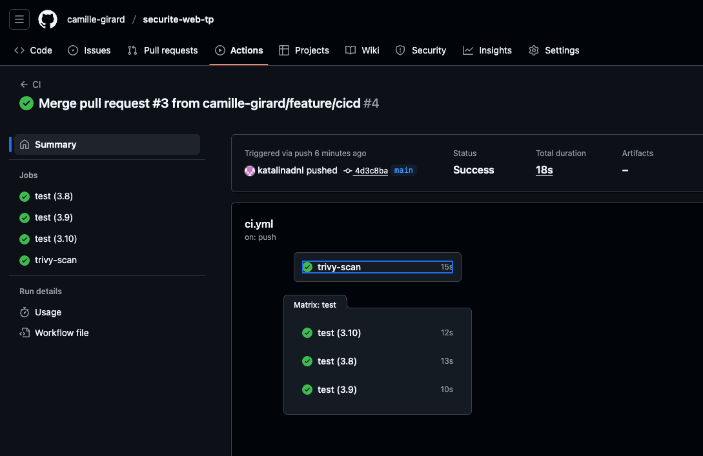
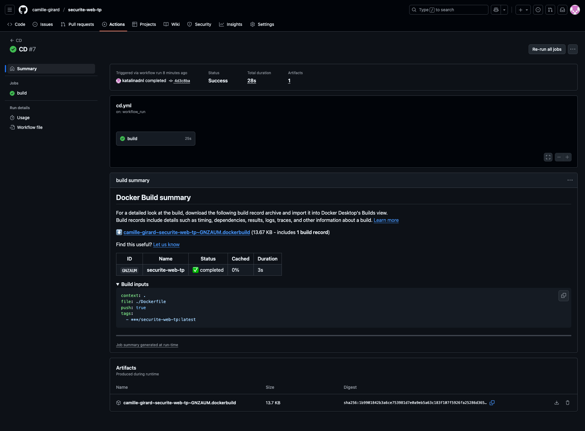
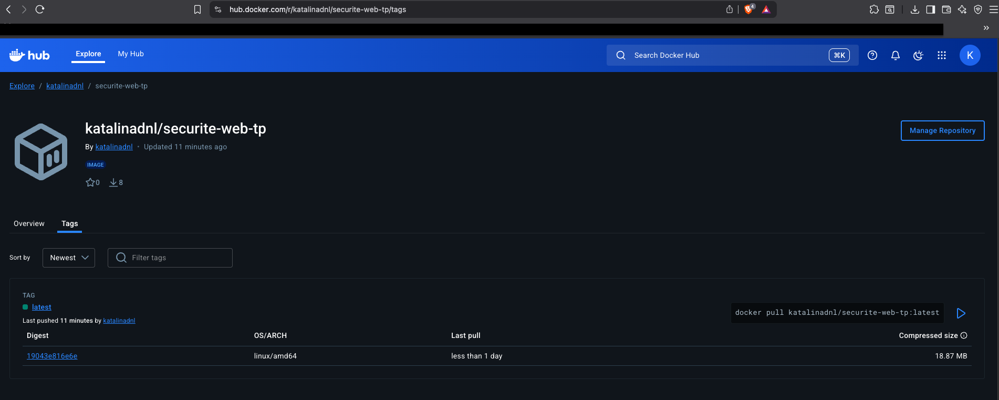

# CI/CD Pipeline – Python Web Security Project

**Authors:**
- *DANILA Catalina*
- *GIRARD Camille*
- *DELENTE Philippe*

# GitHub Repository

**[https://github.com/camille-girard/securite-web-tp](https://github.com/camille-girard/securite-web-tp)**


# CI/CD Pipeline

## CI Workflow – Success


## CD Workflow – Success


## Docker Hub Image


# Project Files

Below are the required workflow files used for the CI/CD pipeline.

## `.github/workflows/ci.yml`

```yaml
name: CI

on:
  push:
    branches: [ main, master ]
  workflow_dispatch:

permissions:
  contents: read
  security-events: write
  actions: read

jobs:
  test:
    runs-on: ubuntu-latest

    strategy:
      matrix:
        python-version: [ "3.8", "3.9", "3.10" ]

    steps:
      - name: checkout
        uses: actions/checkout@v5

      - name: Python ${{ matrix.python-version }}
        uses: actions/setup-python@v6
        with:
          python-version: ${{ matrix.python-version }}

      - name: dependencies
        run: |
          python -m pip install --upgrade pip
          pip install flake8 pytest

      - name: flake8
        run: |
          flake8 . --exclude venv --count --select=E9,F63,F7,F82 --show-source --statistics
          flake8 . --exclude venv --count --exit-zero --statistics

      - name: pytest
        run: pytest tests

  trivy-scan:
    runs-on: ubuntu-latest

    steps:
      - name: checkout
        uses: actions/checkout@v5

      - name: trivy FS mode
        uses: aquasecurity/trivy-action@0.33.1
        with:
          scan-type: fs
          scan-ref: .
          format: sarif
          output: results.sarif
          severity: CRITICAL,HIGH

      - name: upload
        uses: github/codeql-action/upload-sarif@v4
        with:
          sarif_file: results.sarif

```

## `.github/workflows/cd.yml`

```yaml
name: CD

on:
  workflow_run:
    workflows: [ "CI" ]
    types:
      - completed

jobs:
  build:
    if: ${{ github.event.workflow_run.conclusion == 'success' }}
    runs-on: ubuntu-latest

    steps:
      - name: checkout
        uses: actions/checkout@v5

      - name: login
        uses: docker/login-action@v3
        with:
          username: ${{ secrets.DOCKER_USERNAME }}
          password: ${{ secrets.DOCKER_PASSWORD }}

      - name: build and push
        id: push
        uses: docker/build-push-action@v6
        with:
          context: .
          file: ./Dockerfile
          push: true
          tags: katalinadnl/securite-web-tp:latest

```

## Github Secrets

We generated a Personal Access Token on Docker Hub with read and write permissions and added it to our GitHub repository secrets as follows:

| Name               | Description                         |
| ------------------ | ----------------------------------- |
| `DOCKER_USERNAME`  | Our Docker Hub username             |
| `DOCKER_PASSWORD`  | Our Docker Hub token     |


# Conclusion

This project demonstrates a complete CI/CD pipeline integrating testing, code quality, vulnerability scanning and automated Docker deployment.
All workflows run successfully and the Docker image is available on Docker Hub.
