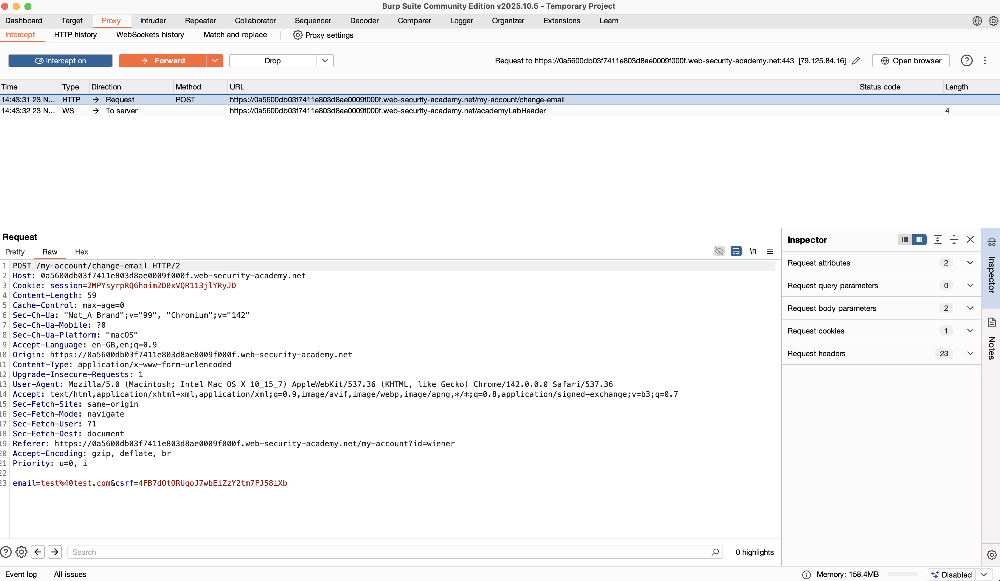

# Portswigger – Challenge 4 : CSRF where token is not tied to user session

## 1. Nom du challenge & URL

**Nom** : Challenge 4 – CSRF where token is not tied to user session

**URL** : `https://portswigger.net/web-security/csrf/bypassing-token-validation/lab-token-not-tied-to-user-session`

---

## 2. Objectif

Le but du challenge est d'exploiter une vulnérabilité **CSRF** (Cross-Site Request Forgery) pour changer l'adresse email du compte de la victime (**carlos**).

**Comptes disponibles pour concevoir l'attaque** :
* **wiener** : peter
* **carlos** : montoya

---

## 3. Étapes de découverte de la vulnérabilité

1. En arrivant sur la page du lab, on voit un site de blog avec deux liens principaux : **Home** et **My account**.

2. On ouvre **Burp Suite** et on active l'interception (Proxy > Intercept > **Intercept is on**).

3. On se connecte avec le compte **wiener:peter** et on accède à la page "My account".

4. On observe un formulaire permettant de changer l'adresse email. On tente de modifier l'email (par exemple : `test@test.com`) et on clique sur **"Update email"**.

5. Dans Burp Suite, on intercepte la requête POST vers `/my-account/change-email`. La requête ressemble à ceci :

   

   On remarque la présence d'un paramètre `csrf` avec une valeur : `4FB7dOtORUgoJ7wbEiZzY2tm7FJ581Xb`
   
   Cela signifie que le site utilise des **tokens CSRF** pour se protéger contre les attaques Cross-Site Request Forgery.

6. On **copie la valeur du token CSRF** et on **drop la requête** pour ne pas effectuer le changement d'email.

7. On remarque donc que le serveur vérifie que le token CSRF est valide, mais il ne vérifie pas à quelle session utilisateur il appartient. Un token généré pour wiener peut donc être utilisé pour effectuer une action sur le compte de carlos.

---

## 4. Payload utilisé

```html
<html>
  <body>
    <form action="https://0a5600db03f7411e803d8ae0009f000f.web-security-academy.net/my-account/change-email" method="POST">
      <input type="hidden" name="email" value="hacker@evil.com" />
      <input type="hidden" name="csrf" value="4FB7dOtORUgoJ7wbEiZzY2tm7FJ581Xb" />
    </form>
    <script>
      document.forms[0].submit();
    </script>
  </body>
</html>
```

### Explication du payload :

* **`<form action="...">`** : formulaire HTML qui cible l'URL de changement d'email du site vulnérable
* **`method="POST"`** : méthode HTTP utilisée par la fonctionnalité de changement d'email
* **`input type="hidden" name="email"`** : champ caché contenant la nouvelle adresse email, celle de l'attaquant
* **`input type="hidden" name="csrf"`** : champ caché contenant le token CSRF valide récupéré depuis la session wiener
* **`<script>document.forms[0].submit();</script>`** : JavaScript qui soumet automatiquement le formulaire dès que la page est chargée

Cela permet de changer automatiquement l'email de la victime lorsqu'elle visite la page malveillante hébergée sur l'exploit server.

---

## 5. Résultat obtenu

1. Sur la page du lab, on clique sur le bouton **"Go to exploit server"**.

2. Dans le champ **"Body"**, on colle le code HTML de l'exploit ci-dessus.

3. On clique sur **"Store"** pour sauvegarder l'exploit sur le serveur.

4. On clique sur **"Deliver to victim"** pour envoyer l'exploit à carlos.

Lorsque carlos visite la page malveillante, son email est automatiquement changé en `hacker@evil.com`

---

## 6. Screenshot

Voici un screenshot prouvant le challenge 4 terminé


---

## 7. Recommandations pour sécuriser la vulnérabilité

Pour corriger cette vulnérabilité CSRF, il faut implémenter les mesures suivantes :

### 7.1. Lier les tokens CSRF aux sessions utilisateur

Le serveur doit vérifier que le token CSRF correspond bien à la session de l'utilisateur qui effectue la requête [1] [2] :

```php
// Générer un token lié à la session
$_SESSION['csrf_token'] = bin2hex(random_bytes(32));

// Vérifier que le token correspond à la session
if (!hash_equals($_SESSION['csrf_token'], $_POST['csrf'])) {
    die('Invalid CSRF token');
}
```

### 7.2. Utiliser l'attribut SameSite sur les cookies

Empêcher l'envoi automatique des cookies lors de requêtes cross-site [2] [3] :

```php
setcookie('session', $session_id, [
    'samesite' => 'Strict',
    'secure' => true,
    'httponly' => true
]);
```

### 7.3. Tokens à usage unique

Implémenter des tokens CSRF qui ne peuvent être utilisés qu'une seule fois [1] [4] :

```php
// Après validation, invalider le token
unset($_SESSION['csrf_token']);
// Générer un nouveau token pour la prochaine requête
$_SESSION['csrf_token'] = bin2hex(random_bytes(32));
```

### 7.4. Vérification de l'origine et du referer

Valider que la requête provient bien du même domaine [2] [5] :

```php
$allowed_origins = ['https://example.com'];
$origin = $_SERVER['HTTP_ORIGIN'] ?? '';

if (!in_array($origin, $allowed_origins)) {
    die('Invalid origin');
}
```

### 7.5. Double submit cookie pattern

Utiliser un token stocké à la fois dans un cookie et dans le formulaire [1] [4] :

```php
// Définir un cookie avec le token
setcookie('csrf_token', $token, ['httponly' => false]);

// Vérifier que le token du formulaire correspond au cookie
if ($_POST['csrf'] !== $_COOKIE['csrf_token']) {
    die('CSRF token mismatch');
}
```

### 7.6. Requêtes sensibles nécessitant une re-authentification

Pour les actions critiques comme le changement d'email, demander le mot de passe actuel [3] [5] :

```php
if (!password_verify($_POST['current_password'], $user['password_hash'])) {
    die('Current password required for this action');
}
```

---

## 8. Références

[1] [OWASP – Cross-Site Request Forgery Prevention Cheat Sheet](https://cheatsheetseries.owasp.org/cheatsheets/Cross-Site_Request_Forgery_Prevention_Cheat_Sheet.html) - Token validation et session binding

[2] [PortSwigger – CSRF Tokens](https://portswigger.net/web-security/csrf/tokens) - Bonnes pratiques pour les tokens CSRF

[3] [MDN – SameSite Cookies](https://developer.mozilla.org/en-US/docs/Web/HTTP/Headers/Set-Cookie/SameSite) - Protection via les cookies SameSite

[4] [OWASP – CSRF](https://owasp.org/www-community/attacks/csrf) - Vue d'ensemble des attaques CSRF

[5] [CWE-352: Cross-Site Request Forgery](https://cwe.mitre.org/data/definitions/352.html) - Description de la vulnérabilité CSRF